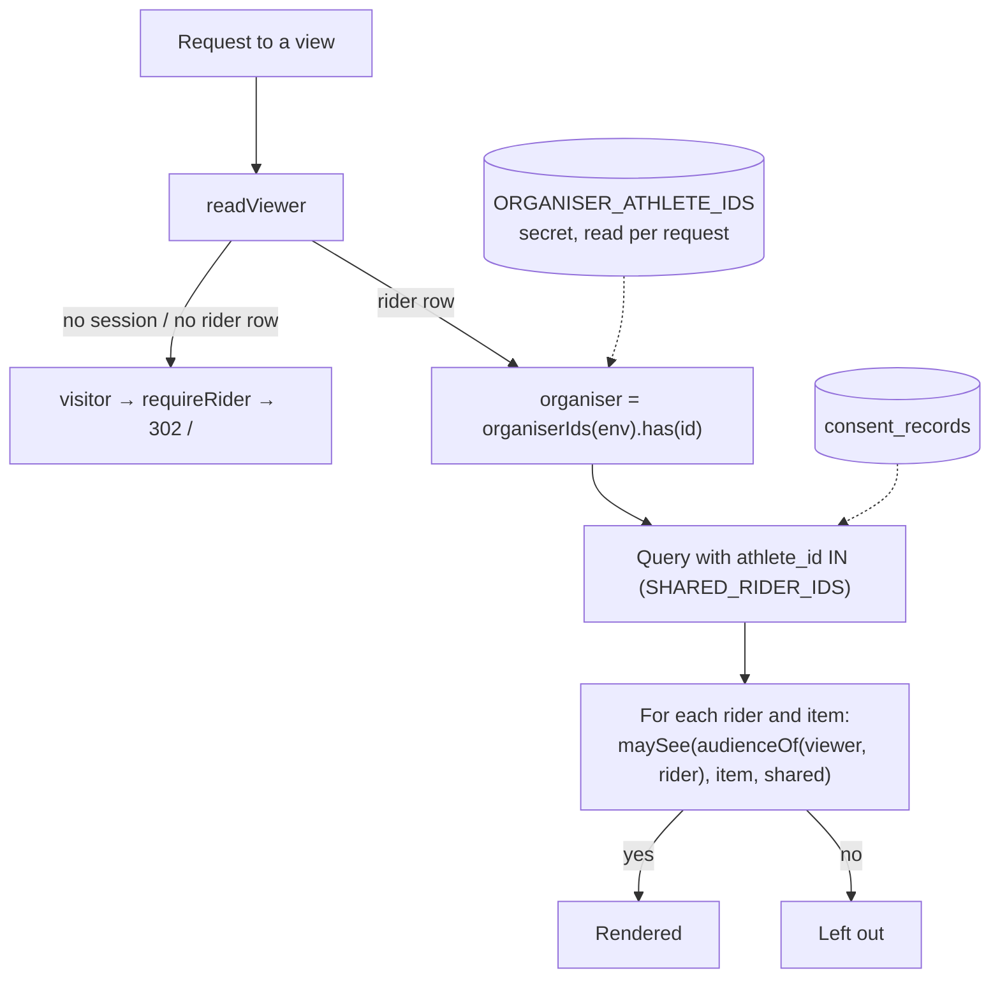

# Implementation Plan: Roles and Rider Consent (User Stories 1–3)

**Branch**: `004-roles-and-consent` | **Date**: 2026-10-07 | **Spec**: [spec.md](spec.md)

**Input**: Feature specification from `/specs/004-roles-and-consent/spec.md`

**Scope**: User Stories 1–3 (all P1). User Story 4 (rider sees and re-agrees to
consent versions) and User Story 5 (Strava review) are planned later.

## Summary

This plan adds the organiser role and one shared visibility rule. It finishes the
consent step that feature 001 built together with this spec.

- **US1, consent at connect**: already built by 001 (commit `9dbf67d`, 001 research
  R21): consent form, version, records, optional write access. Each scenario
  already has a test. One gap remains: a rider connected before the consent step
  is told to sign out and connect again. Instead, `/me` now shows them the consent
  texts and the same form, which goes through Strava again (R1).
- **US2, organisers**: a declared Worker secret `ORGANISER_ATHLETE_IDS`. It is
  parsed on every request, and `readViewer` uses it to decide visitor, rider or
  organiser. An ID counts only if a rider row exists for it. Nothing is stored,
  shown or logged (R2–R4, R8).
- **US3, visibility**: a pure `src/visibility.ts` holds the FR-020 table once.
  `maySee(audience, data, shared)` answers every viewer × rider × item. One SQL
  subquery, `SHARED_RIDER_IDS`, keeps riders without consent out of every row and
  figure (R5, R6). No view is built here. Organiser-admin and team-leaderboard
  use this contract.
- No migration, no new route, no new dependency, and one catalog key reworded.

## Technical Context

**Language/Version**: TypeScript 7 (`tsc --noEmit`) on the Cloudflare Workers
runtime, as in features 001–009.

**Primary Dependencies**: none new. Existing: `html` template, `I18n`, session
helpers, `getRider`, `consent_records` helpers.

**Storage**: D1, unchanged schema (`riders`, `consent_records` from 001 migration
`0004`). One new secret, `ORGANISER_ATHLETE_IDS`
([contracts/configuration.md](contracts/configuration.md)).

**Testing**: Vitest in workerd (`pnpm test`). Pure modules (`roles.ts`,
`visibility.ts`) get unit tests. Viewer, shared riders, hidden IDs and `/me` get
integration tests. `makeCtx` gains an `env` override (R9).

**Target Platform**: Cloudflare Workers; server-rendered HTML, no script.

**Project Type**: web service (one Worker serving pages, webhook, queue and cron).

**Performance Goals**: no measurable cost. Each request parses one short string,
and the existing `getRider` read is reused. `SHARED_RIDER_IDS` is a primary-key
range scan over ≤ 10 riders' records.

**Constraints**:
- The list is never in the repository, pages or logs (FR-002, SC-007).
- A missing or empty list leaves the app working (FR-006).
- The role is decided per request (FR-003).
- All text comes from the catalogs (FR-040).

**Scale/Scope**:
- ≤ 10 riders (Strava capacity, FR-030), a handful of organisers.
- 4 new source files (`roles.ts`, `visibility.ts`, `http/viewer.ts`,
  `http/consent-form.ts`). 5 changed: `consent.ts`, `db/consents.ts`,
  `http/me.ts`, `http/landing.ts`, and the catalogs.
- Config: `wrangler.jsonc`, `worker-configuration.d.ts`, `vitest.config.ts`,
  `package.json`, `dev/fake.env`, `.dev.vars.example`.
- 5 new test files, 4 extended, `test/support/ctx.ts` extended.

## Constitution Check

*GATE: Must pass before Phase 0 research. Re-checked after Phase 1 design
(below).*

| Principle | How this plan complies | Result |
|---|---|---|
| **I. Privacy and consent** (v2.1.0) | One required consent at connect, write access and private activities optional: unchanged from 001. A rider without a record is offered the same consent and is left out of every shared view until they agree. Team-visible data is limited to riders with a recorded consent (`SHARED_RIDER_IDS`, FR-021), as the principle requires for leaderboards. Nothing new is read from Strava or stored. The organiser list is a Cloudflare secret, never committed (R2). Fixtures and sample IDs are synthetic. | Pass |
| **II. Strava API citizenship** | No new Strava request. The consent form for riders without a record goes through the existing OAuth flow, one authorisation per rider. Capacity is unchanged (FR-030). | Pass |
| **III. Rider-authored content wins** | Nothing is written to Strava. Write access stays optional and recorded (FR-012); switching it off by reconnecting without it is 001's existing path (FR-016). | Pass |
| **IV. Serverless, TS, minimal deps** | No dependency, no migration, no new binding. The secret costs nothing on the free tier. The rule is a pure table (R5). | Pass |
| **V. Test-first** | Every FR in scope maps to a failing test first ([quickstart.md](quickstart.md) §1). US1 scenarios are already covered. New behaviour starts red. | Pass |
| **Language** | `me.consent.none` reworded in `de` and `en`. No new key. Code and docs in English. | Pass |
| **Development workflow** | Spec Kit order. Setting the secret before release is a manual maintainer step ([contracts/configuration.md](contracts/configuration.md)). No migration, so nothing to keep compatible. | Pass |

**Post-design re-check (after Phase 1)**: still Pass.
- [data-model.md](data-model.md): no stored entity added; the role is derived per
  request; consent records still cascade with the rider.
- [contracts/viewer-and-visibility.md](contracts/viewer-and-visibility.md): views
  must filter inside SQL with `SHARED_RIDER_IDS`. An athlete ID may appear only in
  an organiser's "View on Strava" link (FR-022).
- [contracts/configuration.md](contracts/configuration.md): the secret's values
  in the repository are synthetic; production's is set by hand.
- [contracts/rider-pages.md](contracts/rider-pages.md): the consent form is the
  landing page's, unchanged; the reworded text exists in both catalogs.

## Delivery

| Delivery | Stories | Requirements | Depends on | Releasable alone |
|---|---|---|---|---|
| **1 (one PR into `develop`)** | US1–US3 | FR-001–FR-007, FR-010–FR-012, FR-015, FR-016, FR-020–FR-023, FR-030, FR-040; FR-013 and FR-014 for version 1 (as built by 001) | 001 (merged) | yes, once the secret is set (Rollout) |
| later | US4 | FR-013 (new versions, re-consent gate), FR-014 (what changed) | delivery 1 | — |
| later | US5 | Strava review | the organiser overview and leaderboard | — |

Within the PR, tasks follow the dependencies:
1. secret wiring (`wrangler.jsonc`, `pnpm types`, test bindings, `dev/fake.env`,
   `package.json`, `.dev.vars.example`) and `makeCtx`'s `env` option;
2. `organiserIds`;
3. `readViewer` and `requireRider`, with `/me` switched over;
4. `SHARING_SINCE_VERSION`, `SHARED_RIDER_IDS`, `listSharedRiderIds`, `isShared`;
5. `visibility.ts`;
6. `consentForm` and the `/me` consent section for riders without a record;
7. the hidden-IDs test;
8. the US1 re-check against [quickstart.md](quickstart.md) §1.

## Project Structure

### Documentation (this feature)

```text
specs/004-roles-and-consent/
├── spec.md
├── plan.md                         # this file
├── research.md                     # R1–R10
├── data-model.md                   # schema used, Viewer, VISIBILITY, shared riders
├── quickstart.md                   # tests per scenario, local walk-through
├── contracts/
│   ├── configuration.md            # ORGANISER_ATHLETE_IDS and its rollout
│   ├── viewer-and-visibility.md    # what the planned views build on
│   └── rider-pages.md              # consent form helper, /me section, message
├── checklists/requirements.md
└── tasks.md                        # /speckit-tasks, not this command
```

### Source Code (repository root)

```text
src/
├── roles.ts                  # new: organiserIds (pure)
├── visibility.ts             # new: RiderData, Audience, VISIBILITY, audienceOf, maySee (pure)
├── consent.ts                # + SHARING_SINCE_VERSION
├── db/consents.ts            # + SHARED_RIDER_IDS, listSharedRiderIds, isShared
├── http/viewer.ts            # new: Viewer, readViewer, requireRider
├── http/consent-form.ts      # new: consentForm (the landing page's form)
├── http/landing.ts           # uses consentForm
├── http/me.ts                # uses readViewer; consent section for riders without a record
└── i18n/messages/{de,en}.ts  # me.consent.none reworded

wrangler.jsonc                # + ORGANISER_ATHLETE_IDS in secrets.required
worker-configuration.d.ts     # pnpm types
vitest.config.ts              # ORGANISER_ATHLETE_IDS: ""
package.json                  # pnpm dev unsets ORGANISER_ATHLETE_IDS
dev/fake.env                  # ORGANISER_ATHLETE_IDS=990004,990099
.dev.vars.example             # + ORGANISER_ATHLETE_IDS with a comment

test/
├── support/ctx.ts            # makeCtx({ env })
├── unit/                     # roles, visibility (new)
└── integration/              # viewer, shared-riders, organiser-ids-hidden (new);
                              # me-status, landing extended
```

**Structure Decision**: the existing single-Worker layout.
- Request-level code (`viewer.ts`, `consent-form.ts`) sits in `src/http/`.
- The two pure modules sit at the top of `src/`, next to `consent.ts`, because
  every later view (HTTP) and query (DB) uses them.
- The SQL helpers sit with the existing consent queries in `src/db/consents.ts`.

## Design diagram

How a planned view decides what to show (US2 + US3):



## Complexity Tracking

No deviation from the constitution.
