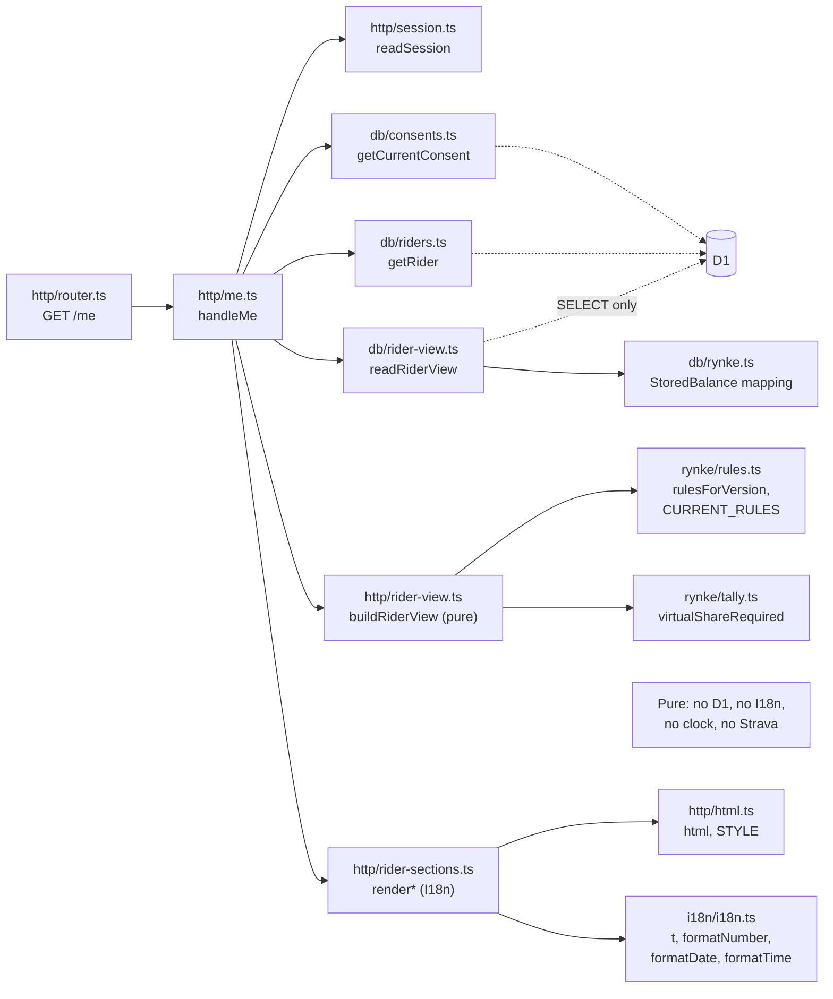
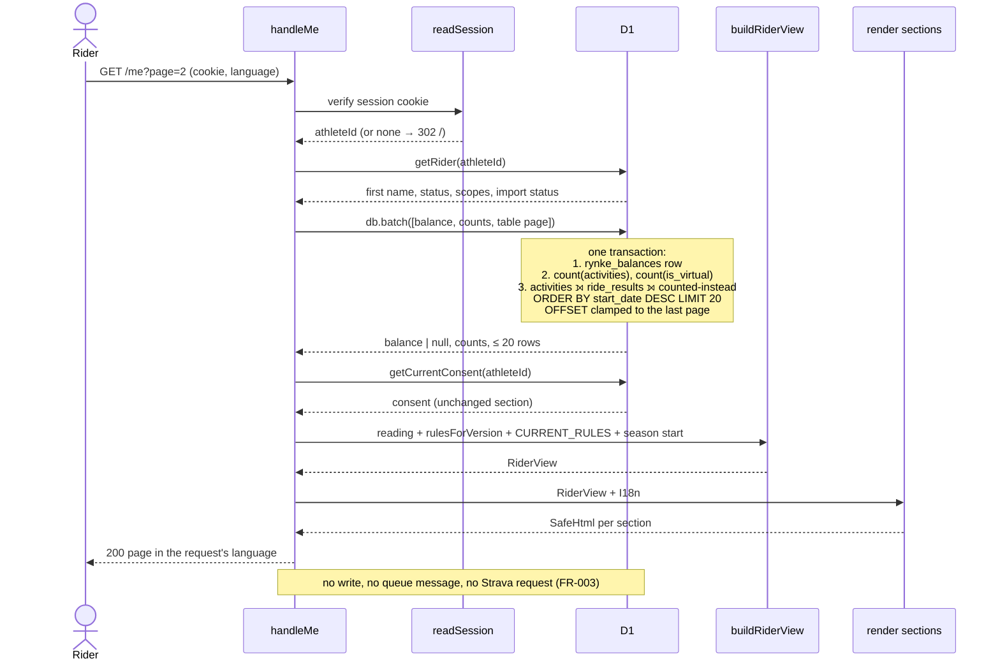
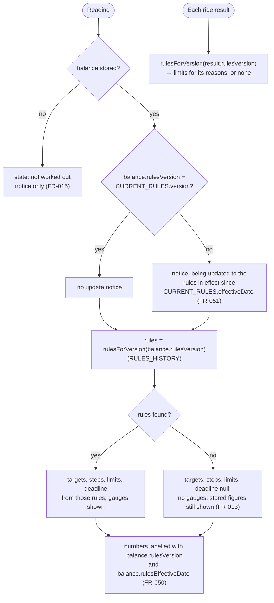
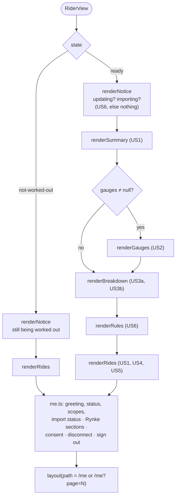
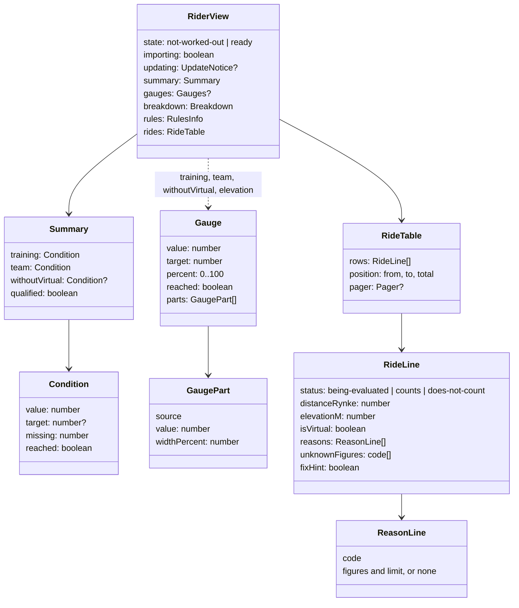
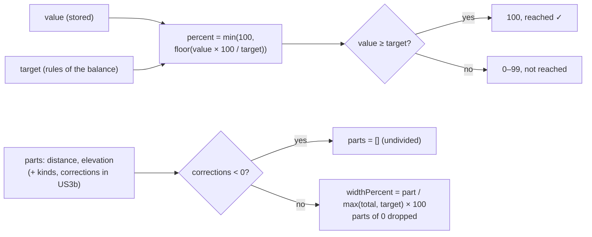
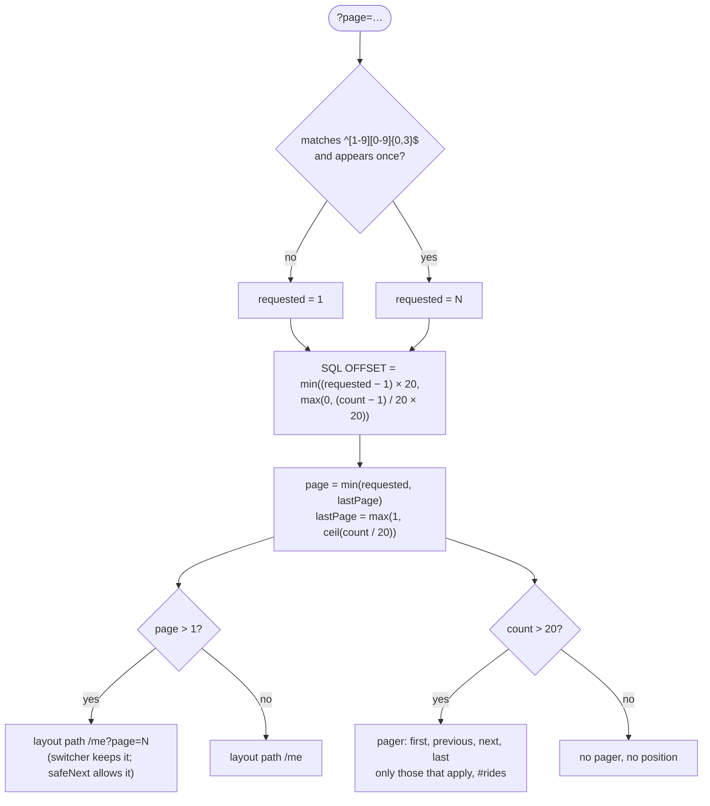
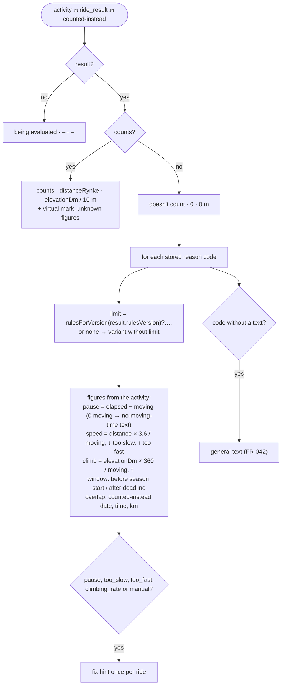
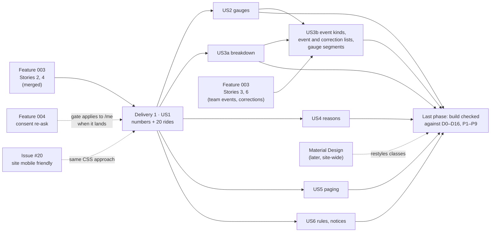

# Implementation Plan: Rider View of Own Rynke

**Branch**: `005-rider-view` | **Date**: 2026-10-07 | **Spec**: [spec.md](spec.md)

**Input**: Feature specification from `/specs/005-rider-view/spec.md`

**Scope of this plan**: all user stories (US1–US7), delivered as the spec's
phases (FR-006, [D0](spec.md#d0-delivery-phases)):
- **US1** is the first delivery and is releasable on its own.
- **US2, US3a, US4, US5 and US6** follow in any order.
- **US3b**, the event-kind rows and the event and correction lists, waits for
  feature 003 Stories 3 and 6 (research R5).
- **US7**, the diagrams, was delivered with the spec. This plan adds the design
  diagrams FR-092 asks for, and the tasks end with a phase that checks the build
  against all of them.

## Summary

The Rynke go into the existing rider page `GET /me` as new sections. There is
no second page (FR-001, research R1).

- **One reading**: each view sends a single D1 batch of read statements (the
  balance, the ride and virtual counts, and one table page of activities joined
  with their ride results and the ride that counted instead). Everything shown
  therefore comes from the same state (FR-005), and the page can't write, queue
  or call Strava (FR-003, research R2).
- **A pure view model**: `buildRiderView` turns that reading, the rule values of
  the balance's version and the rules in effect into a `RiderView`. It works out
  the summary, gauge percentages (rounded down, capped at 100), gauge segments,
  breakdown, ride lines with reason figures (rounded towards the violated
  limit), pager and notices. Thin render functions turn it into HTML with
  catalog text (research R6, R7, R12).
- **Rule values per version**: `rules.ts` keeps a `RULES_HISTORY`, so the page
  can show the targets and limits of the version a balance was computed with.
  When a version is no longer known, those values and the gauges are left out
  (FR-013, research R3). "Being updated" means the balance's version differs
  from `CURRENT_RULES.version` (research R4).
- **Plain HTML and CSS**: the gauges are sized bars with every figure also in
  text (FR-025). The ride table has a main row and a detail row, so nothing is
  hidden on a 360 px phone. Pager and handout links are 44 px tap targets. The
  class names and colour variables are stable, so Material Design can restyle
  the page later (research R7–R10).
- **Paging**: `/me?page=N`, 20 per page. SQL clamps the page to the last one,
  and the language switcher keeps it (research R11).
- **No new dependency, no migration, nothing stored** (research R17).

## Technical Context

**Language/Version**: TypeScript 7 (`tsc --noEmit`), Cloudflare Workers runtime
(`compatibility_date` 2026-08-22), as features 001 and 003.

**Primary Dependencies**: none new. The existing `html` tagged template and
`I18n` (feature 001), and feature 003's `StoredBalance`, `StoredRideResult`,
`REASON_CODES`, `UNKNOWN_FIGURE_CODES` and `CURRENT_RULES`.

**Storage**: D1, read only.
- Reads `riders`, `activities`, `ride_results`, `rynke_balances` and
  `consent_records`.
- No schema change ([data-model.md](data-model.md)).
- The table page uses the existing index `activities_by_rider (athlete_id,
  start_date DESC)`.

**Testing**: Vitest in workerd (`pnpm test`):
- **Unit tests** for the pure view model (gauges at each boundary, segments,
  reason figures and rounding, paging, notices, unknown rules) and for the rules
  history.
- **Integration tests** through `handleFetch`, with seeded synthetic balances,
  ride results and activities: every acceptance scenario, read-only (SC-004),
  isolation (SC-007), languages (SC-008), and 500 rides with the query plan
  (SC-005).
- **Manual checks**: phone layout and wall-clock speed
  ([quickstart.md](quickstart.md) §3).

**Target Platform**: Cloudflare Workers (server-rendered HTML, no client
JavaScript). Browsers: current evergreen desktop and mobile.

**Project Type**: web service. One Worker serving HTML pages, the webhook and
queue and cron handlers.

**Performance Goals**: the page and every table page within 2 s for a rider with
500 rides (SC-005). Per view, one D1 batch of three reads, plus feature 001's
existing reads for the session, rider and consent.

**Constraints**:
- Read-only (FR-003).
- One consistent reading (FR-005).
- Every rule value from the balance's rules (FR-013).
- German and English only from the catalogs (FR-060).
- 360 px without sideways scrolling, 44 px tap targets (FR-070–FR-072).
- Free tier: a page view reads at most about 520 rows (D1 counts rows scanned).

**Scale/Scope**: ≤ 10 riders today (Strava capacity, constitution II), ≤ 500 rides
per rider per season. One page, eight sections, about 75 new message IDs, of
which about 60 come before US3b.

## Constitution Check

*GATE: Must pass before Phase 0 research. Re-checked after Phase 1 design
(below).*

| Principle | How this plan complies | Result |
|---|---|---|
| **I. Privacy and consent** | The page shows a rider only their own data, which Strava's API Agreement allows without sharing consent. The session decides who that is (FR-002); one query parameter is the only input, and it selects a table page, never a rider. No new data is stored. Nothing is put in URLs except the page number. Tests use synthetic riders only. Feature 004's re-ask gate (its FR-013) will apply to `/me` like every page when it is built; until then `/me` shows the stored consent as today. | Pass |
| **II. Strava API citizenship** | The page makes no Strava call and enqueues nothing (FR-003). A test with fake Strava, which fails on any request, and the fake queue proves it (SC-004). | Pass |
| **III. Rider-authored content wins** | Nothing is written anywhere, Strava descriptions included. | Pass (n/a) |
| **IV. Serverless, TS, minimal deps** | No dependency: gauges are HTML and CSS, there is no chart library and no client JS (research R7). The page computes no Rynke; it only reads stored values and derives presentation figures (FR-004). The rules stay pure. `RULES_HISTORY` is data next to `CURRENT_RULES` (research R3). Free tier: one batch per view. | Pass |
| **V. Test-first** | Every story's tests come before its code. The view model is pure and unit-tested at every boundary. Integration tests run against local D1 with fake Strava. | Pass |
| **Language** | All rider-facing text in `de` and `en` catalogs; German is the source, tests assert German. Code, identifiers, class names and docs are in English. The handout link says it is German (FR-053). | Pass |
| **Development workflow** | Spec Kit order. Each delivery is its own PR into `develop`. Nothing touches production; the release is the merge into `main`. | Pass |

**Post-design re-check (after Phase 1)**: still Pass.
- [data-model.md](data-model.md) confirms nothing is stored.
- [contracts/http-routes.md](contracts/http-routes.md) adds only the `page`
  parameter and a narrower `safeNext` rule.
- [contracts/messages.md](contracts/messages.md) keeps every text in both
  catalogs.
- The one change to feature 003's code, `RULES_HISTORY` and the exported
  `virtualShareRequired`, keeps the rules pure and the stored data unchanged.

## Delivery phases

| Delivery | Stories | Requirements | Depends on | Releasable alone |
|---|---|---|---|---|
| **1 (first)** | US1 | FR-001–FR-005, FR-010–FR-015, FR-040, FR-041, FR-060–FR-062, FR-070–FR-072 | feature 003 Stories 2 and 4 (merged) | yes |
| 2 | US2 gauges | FR-020–FR-026 | delivery 1 | yes |
| 3 | US3a breakdown (distance, elevation, totals) | FR-030, FR-031, FR-035 (without corrections) | delivery 1 | yes |
| 4 | US4 reasons | FR-042–FR-044 | delivery 1 | yes |
| 5 | US5 paging | FR-045, FR-046 | delivery 1 | yes |
| 6 | US6 rules and freshness | FR-050–FR-053 | delivery 1 | yes |
| 7 | US3b event kinds, events, corrections; FR-022's event and correction segments | FR-032–FR-035, FR-022 | delivery 3 and feature 003 Stories 3 and 6 | yes |
| last | Check against diagrams | FR-090–FR-092 | each delivery | — |

Deliveries 2–6 may be merged together or one by one. None removes anything an
earlier one shows (FR-006). The first delivery already includes `RULES_HISTORY`
(needed for the targets, FR-013) and the phone CSS for its sections.

## Project Structure

### Documentation (this feature)

```text
specs/005-rider-view/
├── spec.md              # with diagrams D0–D16
├── plan.md              # this file, with design diagrams P1–P9
├── research.md          # R1–R17
├── data-model.md        # what is read, the reading, the view model
├── quickstart.md        # automated and manual checks
├── contracts/
│   ├── http-routes.md   # GET /me?page=N, POST /lang next
│   ├── rider-page.md    # sections, markup, classes, CSS
│   └── messages.md      # new catalog keys, de and en
├── checklists/
│   └── requirements.md
└── tasks.md             # /speckit-tasks (not created by this command)
```

### Source Code (repository root)

```text
src/
├── db/
│   └── rider-view.ts        # NEW readRiderView: one batch (balance, counts, page)
├── http/
│   ├── me.ts                # page param, read, build, place sections; path for the switcher
│   ├── rider-view.ts        # NEW pure buildRiderView and its helpers (no I/O, no I18n)
│   ├── rider-sections.ts    # NEW one render function per section; RULES_HANDOUT_URL
│   ├── html.ts              # STYLE: gauge, rides, pager, tap, notice, phone rules
│   └── lang.ts              # safeNext accepts /me?page=N (US5)
├── i18n/
│   ├── i18n.ts              # formatTime
│   └── messages/de.ts, en.ts   # contracts/messages.md
└── rynke/
    ├── rules.ts             # RULES_HISTORY, rulesForVersion
    └── tally.ts             # exports virtualShareRequired (used by tally and the page)

test/
├── support/
│   └── rider-view.ts        # NEW seed balances, ride results and activities for a rider
├── unit/
│   ├── rider-view.test.ts   # NEW gauges, segments, summary, reasons, paging, notices
│   ├── rules.test.ts        # + history, rulesForVersion
│   ├── tally.test.ts        # + virtualShareRequired
│   └── catalogs.test.ts     # + every reason and unknown-figure code has a text
└── integration/
    ├── me-rynke.test.ts     # NEW acceptance scenarios US1–US6, SC-004, SC-005, SC-007
    ├── me-activities.test.ts    # existing; still green with the new columns
    ├── lang-switcher.test.ts    # + /me?page=N survives
    ├── language-rendering.test.ts  # + Rynke sections in de and en
    └── no-hardcoded-copy.test.ts   # + new modules
```

**Structure Decision**:
- **Read**: the read goes in `src/db/`, where all SQL lives (features 001 and 003).
- **View model**: the pure view model goes next to the page in `src/http/`,
  because it is presentation logic, not Rynke rules. `src/rynke/` stays the
  place that computes Rynke.
- **Rendering**: one render module keeps `me.ts` short. The existing
  `recentRides` in `me.ts` is replaced by the rides section.
- **Rules**: `RULES_HISTORY` lives in `src/rynke/rules.ts`, so the next
  developer to raise the version sees it.

## Design diagrams

Required by FR-092. All figures are synthetic. The spec's diagrams D0–D16 show
*what* the page does; these show *how* it is built. The spec and the contracts
are authoritative. A diagram that disagrees is corrected in the same change
(FR-091).

### P1. Modules and what they may import



### P2. What is read, and in which order (one page view)



### P3. How the rules versions are compared



### P4. How the page is assembled



### P5. The view model



### P6. A gauge from stored values



### P7. The page parameter



### P8. A ride row from stored data



### P9. Deliveries and what they wait for



## Complexity Tracking

No violations.
