# Feature Specification: Rider View of Own Rynke

**Feature Branch**: `005-rider-view`

**Created**: 2026-10-07

**Status**: Draft

**Input**: User description: "Specify the page where a rider sees their own Rynke."
Prompt in full: `specs/backlog/rider-view.md` (removed with this spec). Only the
signed-in rider sees their own data; the page reads what feature 003 stores and
never triggers an evaluation. It shows Training Rynke and Team Rynke against the
thresholds (250 / 25), the amounts still missing and whether the rider qualifies,
including the virtual-ride share (Training Rynke without virtual rides vs. 167); the
breakdown (distance Rynke, the elevation total with its Rynke and the metres to the
next step, each team-event kind with count and Rynke, corrections); per ride whether
it counts, its distance Rynke and elevation metres and every reason it doesn't count
in plain words (for an overlap, which ride counted instead), with elevation Rynke
only in the total; the rules version and when it took effect, and that the numbers
are being updated while a recalculation runs; a link to the rules handout. Extend
`/me` rather than adding a second page, unless planning shows a reason not to.
German labels "Trainingsrynke" and "Teamrynke"; all text in German and English via
the translation strings. Additionally: a phase with comprehensive diagrams.

## Clarifications

### Session 2026-10-07

- Q: Which rides are listed with their results? → A: The 20 most recent, as today,
  plus a way to see every ride of the season: a simple table with paging.
- Q: Does the breakdown list each attended team event and each correction, or only
  counts and sums? → A: Both: the counts and sums, and a list of each attended
  event (date, kind, name) and each correction (date, amount, reason).
- Q (raised by the project owner): How should the current state look? → A: Mostly
  as graphs and gauges that fill up to 100%. Only the current state is shown, no
  history over time. A Material Design look is planned for the site at some point;
  it is not part of this feature.
- Q (raised by the project owner): Does the page have to work on phones? → A: Yes,
  this feature's sections already work on a phone. Making the whole site mobile
  friendly is tracked in issue
  [#20](https://github.com/SaSteffen/RynkePoints/issues/20).
- Q (raised by the project owner): What does the first delivery contain? → A:
  Something relatively simple: the last 20 rides with their points and the overall
  tally as plain numbers (User Story 1). Everything else is built afterwards.

## User Scenarios & Testing *(mandatory)*

Terms as in feature 003: **Training Rynke** (German label "Trainingsrynke"),
**Team Rynke** (German label "Teamrynke"), the **balance** (season tally, feature
003 FR-014a) and the **ride result** (feature 003 FR-014). The **rider page** is the
page a signed-in rider already has (`/me`, feature 001 FR-025: connection status,
permissions, import progress, recent rides, consent, disconnect). A **gauge** shows
how far a value has got towards its target, filled from 0% to 100%. The example
figures below are synthetic and use the current rule values of feature 003 (250
Training Rynke, 25 Team Rynke, 167 Training Rynke without virtual rides, 1 per full
10 km of a ride, 5 per full 1000 m of season elevation).

**Delivery phases** (see [D0](#d0-delivery-phases)): User Story 1 is the first
delivery, deliberately simple, and is releasable on its own. User Stories 2 to 6
follow in later deliveries, each adding to the page without taking away what an
earlier one shows. User Story 7, the diagrams, is delivered with this spec.

### User Story 1 - Rider sees their tally and their last 20 rides' points (Priority: P1, first delivery)

A connected rider opens their rider page. Below the greeting and connection status
they see their Trainingsrynke and Teamrynke as plain numbers, each with what the
tour needs and how many are still missing, and in plain words whether they are in.
If they ride virtually, they also see their Training Rynke without virtual rides
against the 167 needed from outside. The list of their 20 most recent rides, which
the page already has, now also shows for each ride whether it counts, the Training
Rynke it earned from distance and the metres it adds to the elevation total.

**Why this priority**: "Am I in, and what's missing?" is the one question every
rider has; the evaluation (feature 003) is stored but invisible until this exists.
Plain numbers in the existing page are quick to build and answer it completely.

**Independent Test**: Store synthetic balances and ride results for a few riders
(qualified, short of one threshold, short of both, short only of the virtual-ride
share, no balance yet), sign in as each and compare the numbers and the ride list
with what is stored.

**Acceptance Scenarios**:

1. **Given** a rider whose stored balance has 12 Training Rynke and 0 Team Rynke,
   **When** they open their page, **Then** they see 12 of 250 Trainingsrynke with
   238 missing, 0 of 25 Teamrynke with 25 missing, and that they are not in yet.
2. **Given** a rider with 262 Training Rynke and 25 Team Rynke and no virtual rides,
   **When** they open their page, **Then** both thresholds show as reached, nothing
   is missing, they are told they are in, and no virtual-ride share is shown.
3. **Given** a rider with 260 Training Rynke, 100 of them from virtual rides, and 25
   Team Rynke, **When** they open their page, **Then** they see 160 of 167 Training
   Rynke without virtual rides with 7 missing, and are told they are not in yet
   because 7 Training Rynke from outside rides are missing.
4. **Given** a rider with 400 Training Rynke and 20 Team Rynke, **When** they open
   their page, **Then** they are told they are not in yet and that 5 Teamrynke are
   missing; the surplus of Training Rynke is not presented as making up for it.
5. **Given** a rider whose balance was computed with rules whose Training threshold
   is 300, **When** they open their page, **Then** it shows "of 300", not "of 250".
6. **Given** a counting 79 km ride with 1240 m elevation gain among the rider's 20
   most recent rides, **When** they open their page, **Then** its row shows that it
   counts, 7 Trainingsrynke and 1240 m towards the elevation total, and no
   elevation Rynke of its own.
7. **Given** a ride that doesn't count among the 20 most recent, **When** the rider
   opens their page, **Then** its row shows that it doesn't count, with 0
   Trainingsrynke and 0 m.
8. **Given** a ride that was just stored and has no ride result yet, **When** the
   rider opens their page, **Then** its row shows it as being evaluated, not as
   "doesn't count".
9. **Given** a newly connected rider for whom no balance is stored yet, **When**
   they open their page, **Then** they are told their Rynke are still being worked
   out, and no totals, missing amounts or qualification are shown.
10. **Given** two connected riders, **When** one opens their page, **Then** they see
    only their own Rynke and rides.
11. **Given** a visitor who is not signed in, **When** they open the rider page,
    **Then** they are asked to sign in with Strava and see no Rynke.
12. **Given** a phone with a screen 360 pixels wide, **When** the rider opens their
    page, **Then** the numbers and the ride list are readable without zooming and
    without scrolling the page sideways.

---

### User Story 2 - Rider sees their progress as gauges and graphs (Priority: P2)

Next to the numbers of Story 1, each condition for the tour gets a gauge that fills
up towards 100%: Trainingsrynke towards 250, Teamrynke towards 25 and, for riders
who ride virtually, Training Rynke without virtual rides towards 167. A gauge is
full exactly when its condition is met; the rider is in when every gauge is full.
The Training gauge shows in colour how much each source contributed, and a small
gauge shows how far the season's elevation has got towards the next 5
Trainingsrynke.

**Why this priority**: A full or half-full gauge is understood at a glance, also by
riders who don't read the numbers; it is what the project owner wants the page to
look like. It builds on the numbers of Story 1 and is not needed to answer the
question itself.

**Independent Test**: Store synthetic balances just below, exactly at and above each
threshold, with and without virtual rides and negative corrections, sign in and
check each gauge's fill, percentage and text against the stored balance.

**Acceptance Scenarios**:

1. **Given** a rider with 12 Training Rynke and 0 Team Rynke, **When** they open
   their page, **Then** the Training gauge is filled to 4% and the Team gauge is
   empty at 0%.
2. **Given** a rider with 249 Training Rynke, **When** they open their page,
   **Then** the Training gauge shows 99%, not 100%, and is not marked as reached.
3. **Given** a rider with 262 Training Rynke, **When** they open their page,
   **Then** the Training gauge is full at 100%, marked as reached, and still shows
   the number 262.
4. **Given** a rider with 160 Training Rynke without virtual rides, **When** they
   open their page, **Then** the virtual-ride gauge is filled to 95% (160 of 167).
5. **Given** a rider with a season elevation of 1240 m, **When** they open their
   page, **Then** the elevation gauge is filled to 24% (240 of 1000 m) with 760 m to
   the next 5 Trainingsrynke.
6. **Given** a rider with 70 Training Rynke from distance, 30 from elevation, 50
   from team trainings, 40 from training-weekend days, 10 from technique trainings
   and +10 from corrections, **When** they open their page, **Then** the Training
   gauge is filled to 84% (210 of 250) and divided into those six parts in
   proportion, with a legend giving each part's number.
7. **Given** a rider whose corrections are negative, **When** they open their page,
   **Then** the Training gauge is not divided by source, and the corrections show
   in the breakdown instead.
8. **Given** a rider who meets every condition, **When** they open their page,
   **Then** every gauge shown is full and they are told they are in.
9. **Given** a rider using a screen reader or unable to tell colours apart, **When**
   they read the gauges, **Then** each gauge's figures are available as text.
10. **Given** a phone with a screen 360 pixels wide, **When** the rider opens their
    page, **Then** the gauges sit one below the other and stay readable.

---

### User Story 3 - Rider sees where their Rynke come from (Priority: P2)

Below the summary the rider sees the breakdown: Training Rynke from distance; the
season's elevation total, the Rynke it earns and the metres still needed for the
next 5; for each kind of team event how many they attended and the Team and
Training Rynke it earned, with the list of the events themselves; and their
corrections, with each correction listed. The parts visibly add up to the totals.

**Why this priority**: Riders trust a number they can retrace. The event list is how
a rider notices a forgotten attendance entry and asks an organiser (feature 003,
Assumptions).

**Independent Test**: Store a synthetic balance with every source filled in, plus
attendance and corrections, sign in and check every figure and list entry against
what is stored, and that the parts add up to the totals shown.

**Acceptance Scenarios**:

1. **Given** a rider with one counting 79 km ride with 1240 m elevation gain,
   **When** they open their page, **Then** the breakdown shows 7 Training Rynke from
   distance, 1240 m elevation earning 5 Training Rynke with 760 m to the next 5, and
   12 Training Rynke in total.
2. **Given** a rider who attended 2 team trainings and 1 technique training and has
   corrections of +10 Training Rynke, **When** they open their page, **Then** the
   breakdown shows team training 2 × with 2 Teamrynke and 10 Trainingsrynke,
   technique training 1 × with 5 Teamrynke and 5 Trainingsrynke, training weekend
   days 0 × with 0 and 0, and +10 Trainingsrynke from corrections.
3. **Given** the same rider, **When** they open their page, **Then** they see the
   three events with date, kind and name, newest first, and the correction with its
   date, +10 Trainingsrynke and its reason.
4. **Given** a rider whose elevation total is exactly 3000 m, **When** they open
   their page, **Then** it shows 15 Training Rynke from elevation and 1000 m to the
   next 5.
5. **Given** a rider with no rides and no attendance, **When** they open their page,
   **Then** every part of the breakdown shows 0, every team-event kind is listed,
   and the event and correction lists say that there are none.
6. **Given** a rider whose negative corrections exceed what they earned, **When**
   they open their page, **Then** the corrections show with their sign, the total
   shows 0, and the page says that totals never go below 0.

---

### User Story 4 - Rider sees why each ride counts or doesn't (Priority: P2)

In the ride list, a ride that doesn't count lists every reason in plain words, with
the figures that led to it: for a second recording of the same ride, which of their
rides counted instead; for a ride with long breaks, how long it was paused against
its moving time. Virtual rides are marked, and a ride that counts although a rule
could not be checked yet says so.

**Why this priority**: A ride that silently earns nothing is the fastest way to lose
riders' trust in the rules. The handout promises riders they can see the reason for
every ride that doesn't count (feature 003, rules handout).

**Independent Test**: Store synthetic rides with one ride result for every reason
feature 003 knows, plus counting, virtual and unknown-figure rides; sign in and
check each row's reason texts in German and English.

**Acceptance Scenarios**:

1. **Given** a 78 km phone recording that overlaps the rider's counting 80 km bike
   computer recording of the same ride, **When** the rider views their rides,
   **Then** the 78 km ride shows that it does not count because it overlaps the ride
   that counted instead, identified by its date, start time and distance.
2. **Given** a 100 km ride with 4 h moving time and 5 h paused, **When** the rider
   views their rides, **Then** it shows that it does not count because it was paused
   for 5 h, longer than its 4 h moving time.
3. **Given** a 15 km activity entered manually with 2 h moving time, **When** the
   rider views their rides, **Then** it lists both reasons: entered manually, and an
   average speed of 7.5 km/h below the lowest allowed 10 km/h.
4. **Given** a ride for every remaining reason (flagged by Strava, too fast, climbing
   rate, excluded sport type such as an e-bike ride, before the season start, after
   the deadline), **When** the rider views their rides, **Then** each shows its
   reason in plain words, naming the ride's own figure and the limit where there is
   one.
5. **Given** a counting virtual ride, **When** the rider views their rides, **Then**
   it is marked as virtual.
6. **Given** a counting ride whose elapsed time is still unknown (feature 003
   FR-005f), **When** the rider views their rides, **Then** it shows that it counts
   and notes that the pause rule could not be checked yet, so the result may still
   change.
7. **Given** a ride that doesn't count for a reason a rider can fix (pause, speed,
   climbing rate, manual entry), **When** the rider views it, **Then** they are told
   they can correct the ride on Strava or ask an organiser.

---

### User Story 5 - Rider pages through all rides of the season (Priority: P3)

Below the 20 most recent rides the rider can page back through every ride of the
season, 20 at a time, in the same simple table with the same columns.

**Why this priority**: The totals come from every ride of the season, so a rider
must be able to check each of them, but the most recent rides answer most
questions.

**Independent Test**: Store 45 synthetic rides for a rider, sign in and page through
them, checking order, page sizes and the position shown.

**Acceptance Scenarios**:

1. **Given** a rider with 45 rides, **When** they open their page, **Then** the
   table shows their 20 most recent rides, newest first, as in Story 1, says
   "rides 1–20 of 45" and offers the next page.
2. **Given** that rider on the first page, **When** they go to the next page twice,
   **Then** they see rides 21–40 and then 41–45, and can go back to the previous
   and the first page.
3. **Given** a rider with 20 rides or fewer, **When** they open their page, **Then**
   no paging controls are shown.
4. **Given** a rider on the second page, **When** they switch the language, **Then**
   they stay on the second page.
5. **Given** a ride on the third page that overlaps a ride on the first page,
   **When** the rider views it, **Then** the ride that counted instead is still
   identified by its date, start time and distance.
6. **Given** a phone with a screen 360 pixels wide, **When** the rider pages, **Then**
   the paging controls are easy to tap.

---

### User Story 6 - Rider knows which rules apply and whether the numbers are current (Priority: P2)

The page states which rules version the numbers were computed with, since when
those rules apply and which period counts (season start, and the deadline if one is
set), and links to the rules handout. When the organisers changed the rules and the
rider's numbers have not been recalculated yet, the page says that the numbers are
being updated. While the past-season import runs, it says the numbers will grow.

**Why this priority**: Rule changes apply to the whole season (feature 003 FR-021),
so a rider's totals can change without them riding; the page has to explain why.
Not needed for the first delivery, but needed before the first rule change.

**Independent Test**: Store synthetic balances computed with the current and with an
older rules version, and a rider whose import is still running; sign in as each and
check the rules and status texts.

**Acceptance Scenarios**:

1. **Given** a rider whose balance was computed with the rules in effect (version 1,
   in effect since 7 October 2026), **When** they open their page, **Then** they see
   version 1, the date 7 October 2026, the season start and deadline, a link to the
   rules handout, and no notice about updating.
2. **Given** rules version 2 in effect and a rider whose stored results still carry
   version 1, **When** they open their page, **Then** they are told their numbers are
   being updated to the rules in effect since version 2's date, and the numbers
   shown are labelled as computed with version 1.
3. **Given** that rider's recalculation has finished, **When** they open their page
   again, **Then** the notice is gone and version 2 is shown.
4. **Given** a rider whose past-season import is still running, **When** they open
   their page, **Then** they see their current balance and are told it will grow as
   more rides are imported.
5. **Given** the page in English, **When** the rider looks at the rules handout
   link, **Then** the link says that the handout is in German.
6. **Given** a rider opening their page any number of times, **When** the page is
   shown, **Then** no evaluation is started and no request is made to Strava.

---

### User Story 7 - The rider view is documented in diagrams (Priority: P2, delivered with this spec)

Before planning starts, anyone reading this spec can see the rider view at a glance:
the delivery phases, where the numbers come from and that the page only reads them,
who gets to see the page, how it is laid out on a desktop and on a phone, which
states it can be in, how the gauges fill, how qualification and each ride's status
are decided, how paging works, and how the main examples work out. Planning adds
diagrams of its design, and the build is checked against them at the end.

**Why this priority**: The page draws on three earlier features (001, 003, 004) and
has many states; diagrams catch misunderstandings before they are built and make
the review of the plan and the build faster. They cost nothing to keep with the
spec since they are text.

**Independent Test**: Not covered by automated tests (as the rules handout in
feature 003, FR-018). A reviewer checks that every diagram listed in FR-090 exists in
the section [Diagrams](#diagrams), renders on GitHub, and agrees with the
requirements.

**Acceptance Scenarios**:

1. **Given** this spec, **When** a reviewer opens it on GitHub, **Then** every diagram
   in [Diagrams](#diagrams) renders and FR-090's list is covered.
2. **Given** a diagram and a requirement that disagree, **When** a reviewer finds it,
   **Then** the requirement applies and the diagram is corrected in the same change.
3. **Given** the plan for this feature, **When** it is reviewed, **Then** it contains
   diagrams of its design (FR-092).
4. **Given** the tasks for this feature, **When** they are reviewed, **Then** their
   last phase checks the built page against the diagrams (FR-092).

---

### Edge Cases

- **No balance stored yet** (just connected, first evaluation not done): the page
  says the Rynke are still being worked out; it shows no zeros and no empty gauges
  that look like a result (FR-015).
- **Past-season import still running**: the balance shown is real but incomplete;
  the page says it will grow as rides arrive (FR-052).
- **Rule change, rider not recalculated yet**: the page shows the stored numbers
  labelled with their older rules version and a notice that they are being updated
  (FR-051). Ride results and balance are never mixed across rules versions (feature
  003 FR-014b). Before User Story 6 is delivered, the numbers are shown without the
  notice.
- **Rule values during an update**: thresholds, steps and limits are those of the
  rules the shown numbers were computed with, so text and numbers agree; where that
  older version's values are no longer available, they are left out until the
  update is done, and so are the gauges that need them (FR-013).
- **Ride stored but not evaluated yet** (within feature 003 SC-004's 5 minutes): shown
  as being evaluated, never as "doesn't count" (FR-041).
- **Ride with unknown figures**: it can count while a rule could not be checked
  (feature 003 FR-005f); the page says which rule and that the result may change
  (FR-043).
- **The ride that counted instead is on another page**: it is still identified by
  date, start time and distance (FR-042).
- **Several reasons**: all are shown; overlap only appears for rides that pass every
  other rule (feature 003 FR-014).
- **A reason the page doesn't know** (added by a later rules version before the
  translation strings follow): shown with a general "doesn't count under the current
  rules" text, never hidden and never an error page (FR-042).
- **Threshold reached or exceeded**: nothing is shown as missing, never a negative
  amount (FR-014); the gauge is full at 100% and never drawn beyond it (FR-020).
- **Just below a threshold**: 249 of 250 shows 99%; a gauge never shows 100% before
  the condition is met (FR-020).
- **Elevation total exactly on a step**: the elevation gauge is empty and the full
  step (1000 m) is shown as missing for the next 5 (feature 003 stores it so).
- **No virtual rides**: the virtual-ride share and its gauge are not shown; Training
  Rynke without virtual rides then equal the total, so the share is never the only
  thing missing (FR-012).
- **Negative corrections bring a total below 0**: the total shows 0, corrections keep
  their sign, the gauge is not divided by source, and the page says totals never go
  below 0 (FR-022, FR-035).
- **Attendance outside the counting window** (e.g. after the deadline): listed, but
  marked as not counting (FR-033).
- **Deadline passed**: rides after it show "after the deadline" with its date; the
  balance stays as it was at the deadline.
- **Rides shift between pages**: a ride arriving while the rider pages pushes older
  rides one place back; the rider may see a ride twice or miss one until they
  reload. Accepted (FR-046).
- **Page number beyond the last page** (e.g. after rides were deleted): the last page
  is shown.
- **Rider needs to reconnect** (feature 001): their stored Rynke are still shown,
  next to feature 001's reconnect notice; they just won't change until the rider
  reconnects.
- **Rider has not accepted the current consent** (feature 004 FR-013): they are asked
  to agree first, as on every page, before they see the Rynke.
- **Organiser opens the page**: they see their own Rynke like any rider; organiser
  views are separate features.
- **Language switch**: the page switches immediately and stays on the same page and
  table page (feature 001 FR-029a); numbers, durations and dates follow the page
  language (FR-061), the handout link stays German (FR-053).
- **Narrow screen**: columns that don't fit move below the ride's main figures;
  nothing a rider needs disappears (FR-071).
- **A whole season of rides** (up to 500, feature 001 SC-008): only one table page is
  shown at a time, so the page stays fast (SC-005).

## Requirements *(mandatory)*

### Functional Requirements

**Where and for whom**

- **FR-001**: The Rynke MUST be shown on the rider page (feature 001 FR-025) as
  additional sections, not on a second page, unless planning finds a reason not to;
  then the plan states the reason and this spec is updated. Everything the rider
  page already shows (connection status, permissions, import progress, consent,
  disconnect) MUST stay.
- **FR-002**: Only the signed-in rider MUST see their own Rynke, ride results and the
  data behind them. A visitor who is not signed in MUST be asked to sign in with
  Strava and see none of it (feature 001, US4). A rider who has not accepted the
  current consent is first asked to agree (feature 004 FR-013). Organisers see only
  their own Rynke on this page.
- **FR-003**: The page MUST only read what features 001, 003 and 004 store (rider and
  import status, activities, ride results, balance, rules, team events, attendance,
  corrections, team settings, consent). Opening it MUST NOT start an evaluation,
  change any stored data or contact Strava (feature 003 FR-014b).
- **FR-004**: Every Rynke figure, missing amount and the qualification MUST be the
  stored value; the page MUST NOT compute Rynke itself. It MAY derive presentation
  figures from stored values: gauge percentages (FR-020), and the paused time,
  average speed and climbing rate in a reason from the ride's stored activity
  figures (FR-042).
- **FR-005**: The balance and the ride results shown together MUST come from one
  consistent reading, so the page never shows a balance next to ride results of a
  different moment or rules version (feature 003 FR-014b).
- **FR-006**: The first delivery MUST be User Story 1 only (FR-010–FR-015, FR-040,
  FR-041, FR-060–FR-062, FR-070–FR-072 for what it shows) and MUST be releasable on
  its own. Later deliveries add the other stories in any order and MUST NOT take
  away anything an earlier delivery shows.

**Summary (first delivery)**

- **FR-010**: The page MUST show, first after the greeting and connection status,
  the rider's Training Rynke and Team Rynke as numbers, each with its threshold and
  the amount still missing.
- **FR-011**: The page MUST say in plain words whether the rider qualifies (feature
  003 FR-013). If not, it MUST name each unmet condition and how much is missing for
  it; extra Rynke of one kind MUST NOT be presented as making up for the other.
- **FR-012**: When at least one of the rider's rides is a virtual ride, the page MUST
  show the Training Rynke without virtual rides against the amount needed from
  outside rides (feature 003 FR-013a, currently 167) and the amount still missing.
  Without virtual rides it is not shown.
- **FR-013**: Every rule value the page shows (thresholds, the amount needed without
  virtual rides, steps, limits, the deadline) MUST be that of the rules the balance
  was computed with; no rule value is fixed in page text. Where the values of that
  version are no longer available (an older version during an update, FR-051), the
  page MUST leave them and the gauges needing them out rather than show the values
  of another version; the stored totals, missing amounts and qualification are
  still shown.
- **FR-014**: A threshold that is reached or exceeded MUST show as reached, never as
  a negative missing amount.
- **FR-015**: When no balance is stored for the rider yet, the page MUST say that
  their Rynke are still being worked out and MUST NOT show totals, missing amounts,
  gauges or a qualification.

**Gauges and graphs**

- **FR-020**: Each condition of the summary (Training Rynke against the Training
  threshold, Team Rynke against the Team threshold, and, when shown under FR-012,
  Training Rynke without virtual rides against the amount needed) MUST have a gauge
  filled to the share reached, from 0% to 100%. The percentage MUST be rounded down,
  so a gauge shows 100% exactly when the condition is met; a gauge MUST never be
  drawn beyond 100%. A full gauge MUST be marked as reached and still show the
  actual number (e.g. 262 of 250).
- **FR-021**: The season's elevation total MUST have a gauge showing how far it has
  got towards the next step (e.g. 240 of 1000 m, 24%), with the metres still
  missing.
- **FR-022**: The filled part of the Training gauge MUST be divided into the sources
  of the Training Rynke (distance, elevation, each team-event kind, corrections) in
  proportion, and the Team gauge into the team-event kinds and corrections, each
  with a legend giving its number. When a gauge's corrections are negative, that
  gauge MUST NOT be divided.
- **FR-023**: The qualification (FR-011) MUST be shown together with the gauges; the
  rider is shown as in exactly when the stored balance says they qualify, which is
  when every gauge of FR-020 shown is full.
- **FR-024**: Gauges and graphs MUST show only the current state; no history over
  time is shown on this page.
- **FR-025**: Every gauge and graph MUST carry its figures as text, so they can be
  read without seeing colours or the drawing (e.g. with a screen reader); colour
  MUST NOT be the only way a source or "reached" is told apart.
- **FR-026**: The numbers of FR-010–FR-012 MUST stay visible next to the gauges.

**Breakdown**

- **FR-030**: The page MUST show the Training Rynke from distance.
- **FR-031**: The page MUST show the season's elevation total in metres, the Training
  Rynke it earns, the metres still missing for the next step, and the step itself
  (currently 5 Training Rynke per 1000 m) from the rules of the balance.
- **FR-032**: The page MUST show, for each of the three team-event kinds (team
  training, training-weekend day, technique training), how many the rider attended
  and the Team Rynke and Training Rynke they earned, also when the count is 0.
- **FR-033**: The page MUST list each team event the rider was recorded for, newest
  first, with date, kind and name if it has one. An event outside the counting
  window MUST be marked as not counting.
- **FR-034**: The page MUST show the sum of corrections for each kind of Rynke, with
  its sign, and list each correction, newest first, with its date, its amount of
  each kind of Rynke with sign, and its reason.
- **FR-035**: The parts of the breakdown MUST visibly add up to each total. Where a
  total is 0 because negative corrections exceed what was earned, the page MUST say
  that totals never go below 0.

**Rides**

- **FR-040**: The ride list of the rider page (feature 001 FR-025, the 20 most recent
  rides, newest first) MUST show for each ride, besides its date, sport type,
  distance and elevation gain: whether it counts, the Training Rynke it earned from
  distance and the metres it adds to the elevation total. It MUST NOT show elevation
  Rynke per ride (feature 003 FR-014).
- **FR-041**: A stored ride without a ride result yet MUST show as being evaluated.
- **FR-042**: A ride that doesn't count MUST list every stored reason in plain
  words. Where the reason has figures, it MUST name the ride's own figure and the
  limit of the rules the ride result was computed with (left out as in FR-013):
  - flagged by Strava: Strava flagged the ride, and a rider who disagrees settles it
    with Strava;
  - pause: the paused time against the moving time, and the largest allowed share
    of it (pausing longer than moving under rules version 3, more than half before);
  - manual entry: entered manually on Strava;
  - too slow / too fast: the average speed against the lowest / highest allowed;
  - climbing rate: metres climbed per hour against the highest allowed;
  - excluded sport type: the sport type (e.g. e-bike ride) and that it doesn't
    count;
  - outside the counting window: before the season start or after the deadline,
    with the date;
  - overlap: the ride that counted instead, by date, start time and distance.
  A reason value without a translation MUST be shown with a general "doesn't count
  under the current rules" text, never hidden.
- **FR-043**: A virtual ride MUST be marked as virtual. A ride whose result lists
  unknown figures (feature 003 FR-005f) MUST say which rule could not be checked yet
  and that its result may still change.
- **FR-044**: A ride that doesn't count because of the pause rule, speed, climbing
  rate or manual entry MUST tell the rider they can correct the ride on Strava or
  ask an organiser.
- **FR-045**: The ride list MUST become a table of all the rider's stored rides,
  newest first, 20 per page, whose first page is the list of FR-040. It MUST show the
  position (e.g. "rides 21–40 of 45") and let the rider go to the next, previous,
  first and last page. With 20 rides or fewer, no paging controls are shown.
- **FR-046**: Each table page is one consistent reading (FR-005). Paging MUST keep
  the rider on the rider page, and switching the language MUST keep the table page.
  Rides moving to another page because rides arrived or were deleted in between is
  accepted; a page number beyond the last page shows the last page.

**Rules and freshness**

- **FR-050**: The page MUST show the rules version the balance was computed with, the
  date those rules took effect, and the counting window: the season start and, if
  set, the deadline.
- **FR-051**: When the rules version of the rider's stored results is older than the
  rules in effect, the page MUST say that the numbers are being updated to the
  rules in effect since their date, and keep showing the stored numbers labelled
  with their own version. Otherwise no such notice is shown.
- **FR-052**: While the rider's past-season import is running (feature 001), the page
  MUST say that the balance will grow as more rides are imported.
- **FR-053**: The page MUST link to the rules handout (feature 003 FR-017). The handout
  is German only (feature 003 FR-020); in other languages the link MUST say so.

**Language**

- **FR-060**: All text of this feature, including gauge labels, legends and their text
  versions, MUST come from the translation strings in German and English (feature
  001 FR-028–FR-030). The German labels MUST be "Trainingsrynke" and "Teamrynke";
  the English ones "Training Rynke" and "Team Rynke".
- **FR-061**: Numbers, percentages, distances, durations and dates MUST be formatted
  for the page language (e.g. "1.240 m" in German, "1,240 m" in English).
- **FR-062**: Reasons and team-event kinds MUST be translated from the
  language-independent values feature 003 stores (feature 003 FR-016); every value
  feature 003 defines MUST have a text in every language.

**Phones**

- **FR-070**: Every section of this feature MUST work on a phone in portrait with a
  screen 360 pixels wide: readable without zooming and without scrolling the page
  sideways. Gauges MUST sit one below the other there.
- **FR-071**: On a narrow screen the ride table MUST keep date, distance, whether the
  ride counts, its Training Rynke and its metres in view; sport type, elevation
  gain, the virtual mark and the reasons MAY move below them but MUST stay on the
  page.
- **FR-072**: Links, paging controls and other controls of this feature MUST be easy
  to tap (about 44 × 44 pixels). The rest of the site follows issue
  [#20](https://github.com/SaSteffen/RynkePoints/issues/20).

**Diagrams**

- **FR-090**: This spec MUST contain, in its section [Diagrams](#diagrams), diagrams
  of: the delivery phases; where the shown data comes from and that the page only
  reads it; the stored data the page reads and how it relates; who sees the page;
  the page layout on a desktop and on a phone; the states of the page and of a ride
  row; how a gauge fills; how qualification is decided; how a ride's status and
  reasons are shown; how paging works; how a page view and a rule-change update
  unfold over time; and the gauge, overlap and elevation examples.
- **FR-091**: The diagrams MUST be text in the Markdown (rendered by GitHub), not
  image files, and MUST use only synthetic example figures (constitution Principle
  I). This spec is authoritative: a diagram that disagrees with a requirement MUST
  be corrected in the same change, and every change to a requirement MUST update the
  diagrams it affects.
- **FR-092**: The plan MUST add diagrams of its design (what is read and in which
  order, how the rules versions are compared, how the page is assembled), and the
  tasks MUST end with a phase that checks the built page against all diagrams and
  updates them where the build differs from them for a reason the spec allows.

### Key Entities

This feature stores nothing new. It reads:

- **Rider** (feature 001): first name, connection status, past-season import status.
- **Activity** (feature 001): date, sport type, distance, moving and elapsed time,
  elevation gain of each ride, for the ride table and the figures in reasons.
- **Ride Result** (feature 003 FR-014): whether a ride counts, its reasons, the ride
  it overlaps, distance Rynke, metres for the elevation total, virtual flag, unknown
  figures, rules version.
- **Rynke Balance** (feature 003 FR-014a): totals, breakdown, missing amounts,
  Training Rynke without virtual rides, qualification, rules version and its date.
- **Rynke Rules** (feature 003): the version in effect and its date, and the values
  of the version a balance was computed with (thresholds, steps, limits, deadline).
- **Team Settings** (feature 001): the season start.
- **Team Event and Attendance** (feature 003): the events the rider was recorded for
  (date, kind, name).
- **Correction** (feature 003): date, amounts, reason.
- **Consent** (feature 004): unchanged, still shown on the page.

## Success Criteria *(mandatory)*

### Measurable Outcomes

- **SC-001**: In a walkthrough with at least 3 team members using synthetic data,
  each answers "Am I in, and what is missing?" correctly from the page alone within
  30 seconds, with the first delivery already.
- **SC-002**: For feature 003's reference set of at least 20 hand-calculated
  synthetic riders, 100% of the totals, breakdown figures, missing amounts and
  qualifications on the page equal the stored balance.
- **SC-003**: Every ride result reason and team-event kind feature 003 defines has a
  text in German and English, and every reason text names the ride's figure and
  limit where FR-042 asks for one.
- **SC-004**: Opening the page or any table page any number of times starts zero
  evaluations, changes no stored data and makes zero requests to Strava.
- **SC-005**: For a rider with 500 rides in the season, the page and every table page
  are shown within 2 seconds under normal conditions.
- **SC-006**: In 100% of tested cases the "being updated" notice appears exactly when
  the rider's stored results carry an older rules version than the rules in effect.
- **SC-007**: With two or more synthetic riders, no page view shows any data of a
  rider other than the signed-in one.
- **SC-008**: Every text of this feature is fully German for a German page and fully
  English for an English page (feature 001 SC-010).
- **SC-009**: In 100% of tested cases (just below, at and above each threshold) a
  gauge shows 100% exactly when its condition is met, and never more.
- **SC-010**: On a phone screen 360 pixels wide, every section of this feature is
  readable without zooming and without scrolling the page sideways.

## Assumptions

- Builds on feature 001 (rider page, sign-in, languages), feature 003 (stored ride
  results, balance, rules with version and date) and feature 004 (consent, roles).
  Nothing in those features changes; this feature only reads.
- The rider page stays the one page a signed-in rider has; the Rynke sections come
  first after the greeting and connection status, the existing consent and
  disconnect sections follow (see [D4](#d4-page-layout-desktop)).
- The look is kept plain: the page's current simple styling, with gauges as simple
  bars. A Material Design look for the whole site is planned for later as a separate
  change; this feature's gauges, legends, table and paging controls should be able
  to take that look without changing what they show.
- Making the rest of the site mobile friendly is tracked in issue
  [#20](https://github.com/SaSteffen/RynkePoints/issues/20); this feature only makes
  its own sections work on phones (FR-070–FR-072).
- The rules handout link points to the handout as published in the public
  repository (`docs/rynke-punkte.md`); serving the PDF from the app is out of scope.
  The handout's section "Wo sehe ich meinen Stand?" describes this page; its
  sentence that only the rider sees their balance predates feature 004 (organisers
  and the team see parts of it) and is for feature 003 to align (its FR-019).
- Feature 003 keeps only the rules in effect; the balance stores its rules version
  and that version's date. While a rider is being updated, the values of the older
  version are therefore not available and the page leaves them out (FR-013).
  Planning may keep earlier versions' values readable instead; that changes only
  what is left out, not this spec.
- Rides are not linked to Strava from this page; if a later change adds links, they
  follow Strava's "View on Strava" guideline.
- No history of a rider's own Rynke over time (e.g. a weekly graph) is shown here
  (FR-024); the team leaderboard (backlog) has the per-week view, and
  [feature 009](../009-rider-progress-charts/spec.md) specifies a rider's
  own charts.
- The leaderboard, the organiser overview, the organiser pages and writing Rynke into
  Strava activity descriptions are separate features ([specs/backlog/](../backlog/README.md)).

## Diagrams

All figures are synthetic. The text above is authoritative (FR-091).

Corrections (FR-034, the corrections parts of FR-022 and FR-035) wait for
feature 003 Story 6. Until it is merged, the page reads no corrections and shows
no corrections rows or list, so D1, D2, D4, D8, D9 and D13 show more than the
built page (tasks.md Phase 9b).

### D0. Delivery phases

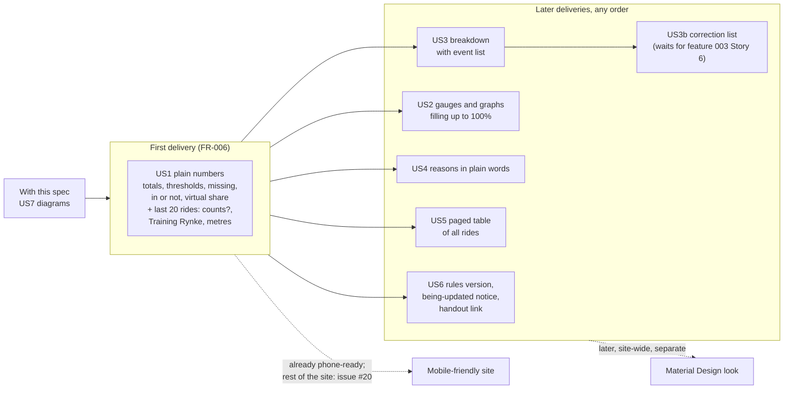

### D1. Where the numbers come from

The page reads; it never evaluates and never calls Strava (FR-003).

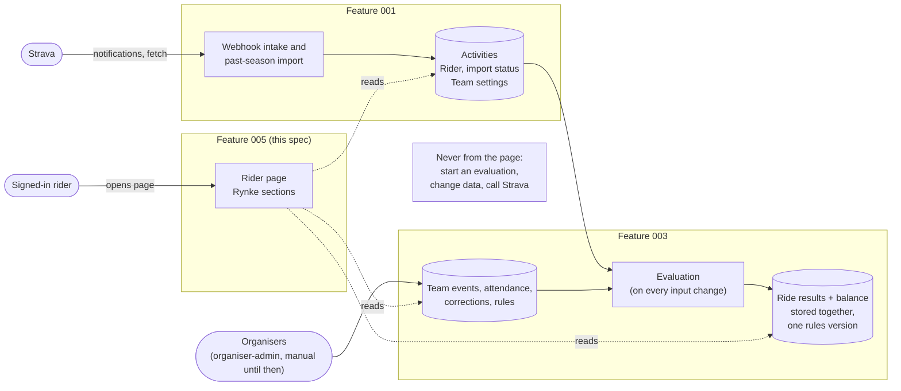

### D2. What the page reads

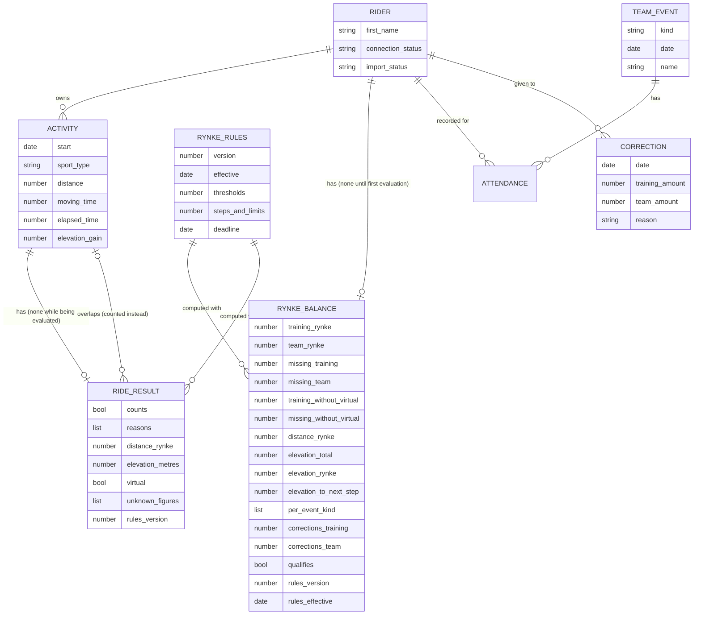

### D3. Who sees the page

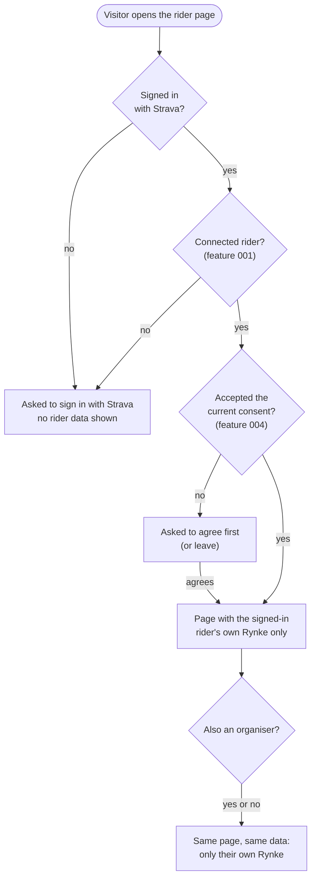

### D4. Page layout (desktop)

The order of sections and the story that brings each one; wording comes from the
translation strings (FR-060). Shown with English labels and the figures of US1
scenario 1.

```mermaid
flowchart TB
    subgraph page["Rider page"]
        direction TB
        head["Greeting, connection status, permissions,<br/>import progress (feature 001)"]
        fresh["US1 + US6 · Notice, only when it applies:<br/>still being worked out (FR-015) /<br/>numbers being updated (FR-051) /<br/>will grow while importing (FR-052)"]
        summary["US1 · Summary (FR-010 to FR-015)<br/>Training Rynke 12 of 250, 238 missing<br/>Team Rynke 0 of 25, 25 missing<br/>Not in yet: 238 Training Rynke and 25 Team Rynke missing"]
        gauges["US2 · Gauges (FR-020 to FR-026)<br/>Training ▓░░░░░░░░░ 4%<br/>Team ░░░░░░░░░░ 0%<br/>(Training without virtual rides, only with virtual rides)<br/>Elevation to the next 5 ▓▓░░░░░░░░ 24%"]
        breakdown["US3 · Breakdown (FR-030 to FR-035)<br/>Distance 7 · Elevation 1,240 m = 5, 760 m to the next 5<br/>Team training 0× · Training weekend days 0× · Technique training 0×<br/>Corrections 0 / 0 (Story 6) · Total 12 / 0<br/>Your team events · Your corrections (Story 6)"]
        rules["US6 · Rules (FR-050, FR-053)<br/>Version 1 in effect since 7 Oct 2026<br/>Counting from season start to deadline<br/>Rules handout (in German)"]
        rides["US1 · Rides (FR-040, FR-041)<br/>date · sport · km · m · counts? · Training Rynke · metres for elevation<br/>US4 · reasons, virtual mark, hints (FR-042 to FR-044)<br/>US5 · rides 1–20 of 45 · next · last (FR-045, FR-046)"]
        consent["Your consent (feature 004)"]
        leave["Disconnect and delete my data (feature 001)"]
        head --> fresh --> summary --> gauges --> breakdown --> rules --> rides --> consent --> leave
    end
```

### D5. Page layout (phone, 360 pixels wide)

Everything in one column; nothing scrolls sideways (FR-070, FR-071).

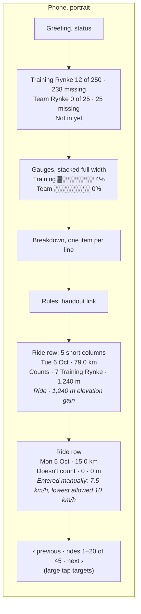

### D6. Page states

Which notice the page shows, per rider (FR-015, FR-051, FR-052).

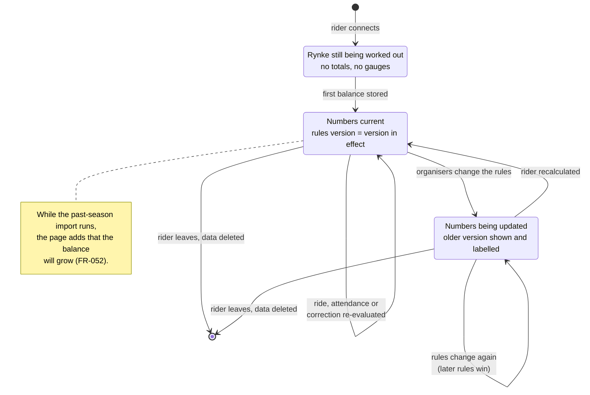

### D7. A ride row

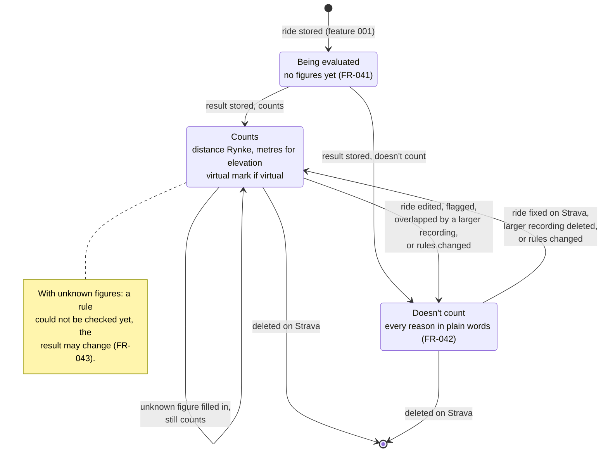

### D8. How a gauge fills

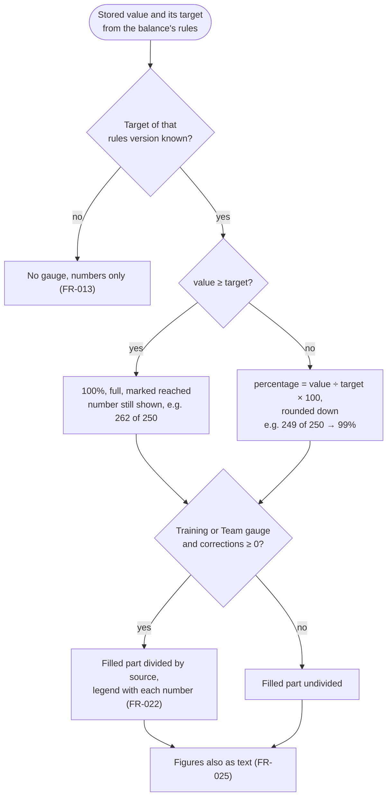

### D9. Gauge example (US2 scenario 6)

210 of 250 Training Rynke, shown as one bar of 25 blocks of 10 Training Rynke each.

```mermaid
block-beta
    columns 25
    d["Distance 70"]:7
    e["Elevation 30"]:3
    t["Team trainings 50"]:5
    w["Weekend days 40"]:4
    k["Technique 10"]:1
    c["Corrections +10"]:1
    m["40 missing"]:4
    style m fill:#ffffff,stroke:#999999,stroke-dasharray:4
```

The same rider's gauges side by side, with no virtual rides and no Team Rynke
corrections (10 team trainings, 4 weekend days and 2 technique trainings give 40
Team Rynke) and a season elevation of 6240 m:

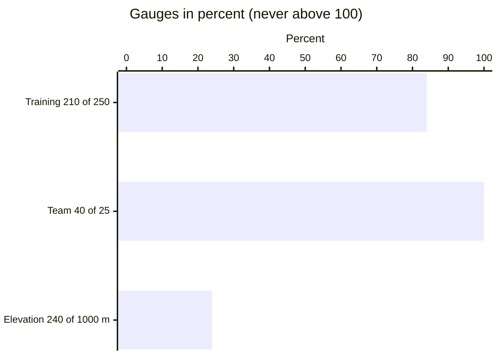

### D10. How qualification is shown

All three conditions come from the stored balance (FR-004); the page explains them,
it does not decide them.

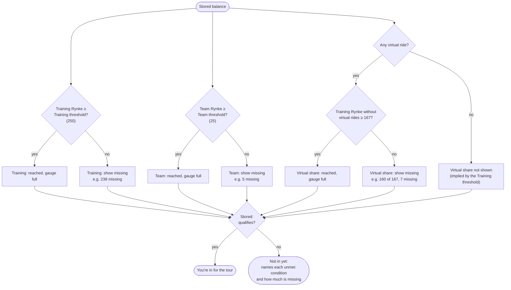

### D11. How a ride's status and reasons are shown

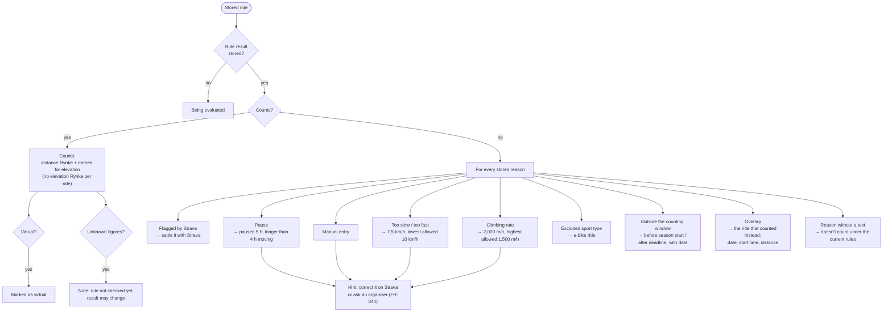

### D12. Paging through the rides (45 rides)

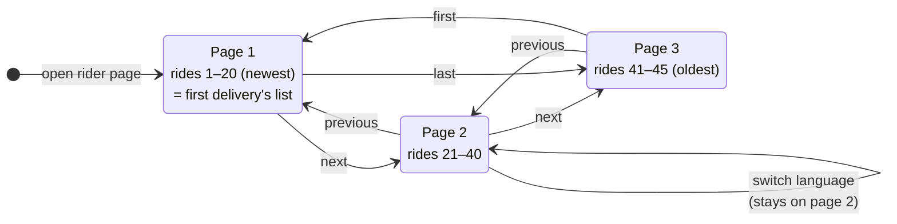

### D13. A page view over time

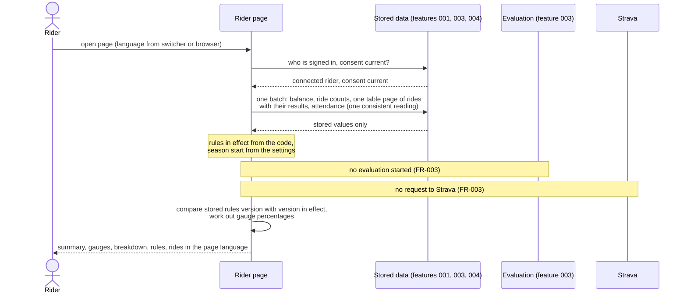

### D14. A rule change while the rider looks

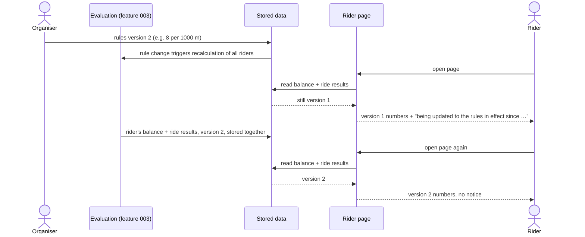

### D15. Overlap example (US4 scenario 1)

```mermaid
gantt
    title Same ride recorded twice
    dateFormat HH:mm
    axisFormat %H:%M
    section Bike computer
    80 km, 600 m - counts                 :done, a, 08:00, 210m
    section Phone
    78 km, 650 m - overlaps the 80 km ride :crit, b, 08:02, 206m
```

The phone recording's row reads, in English: "Doesn't count: overlaps your ride of
<date>, 08:00, 80.0 km, which counts instead."

### D16. Elevation example (US3 scenario 1)

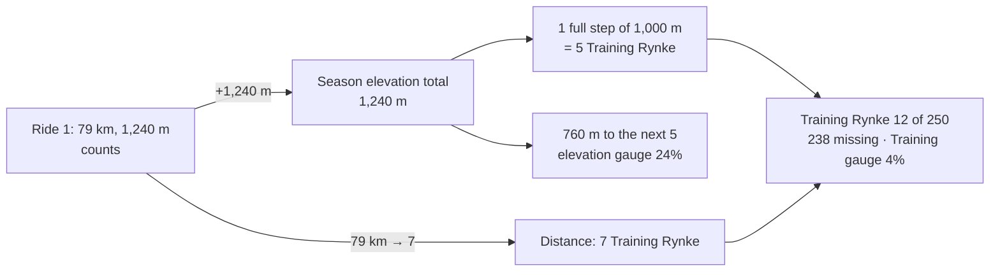
