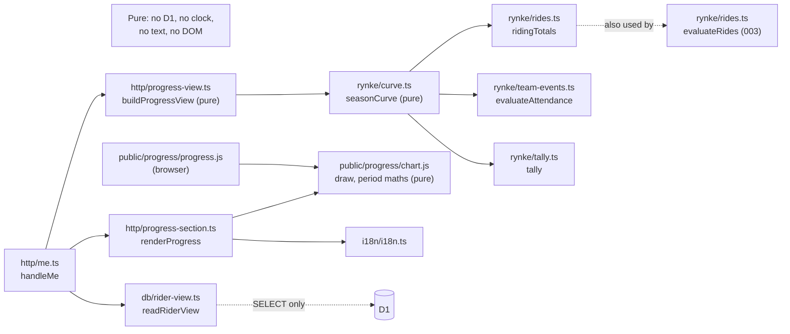
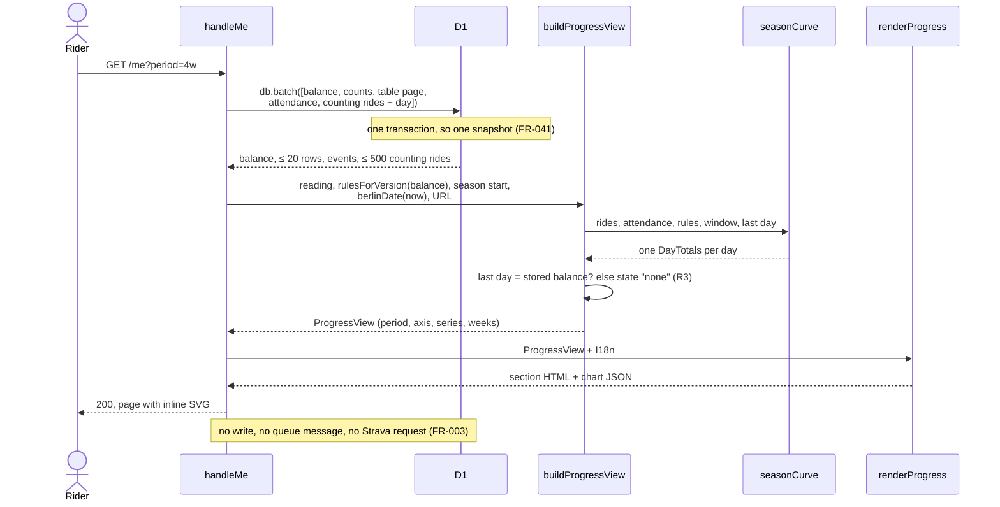
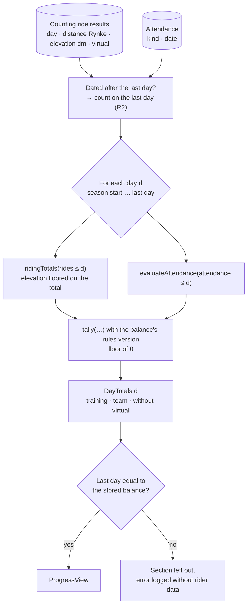
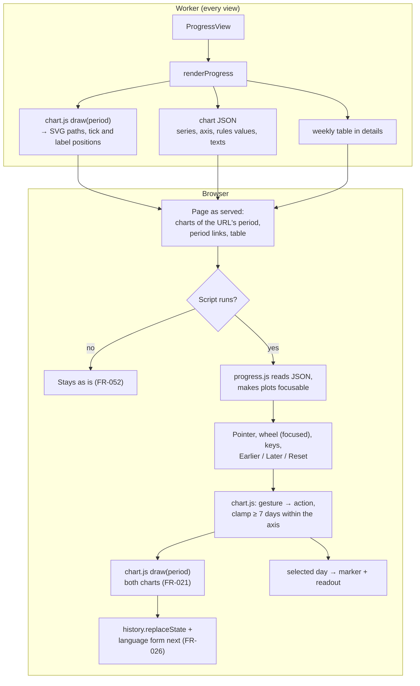
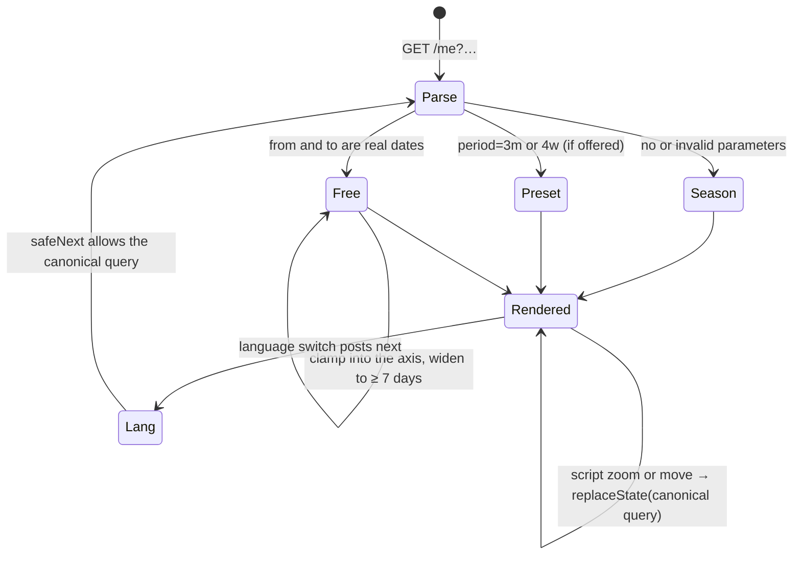
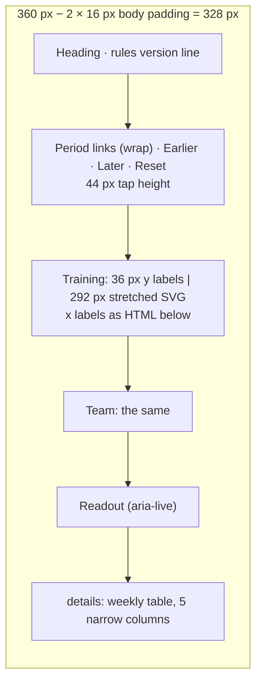

# Implementation Plan: Rider Progress Charts

**Branch**: `009-rider-progress-charts` | **Date**: 2026-10-07 | **Spec**: [spec.md](spec.md)

**Input**: Feature specification from `/specs/009-rider-progress-charts/spec.md`

## Summary

`/me` gets a progress section below the rules: two zoomable line charts of how
the rider's Training Rynke and Team Rynke grew over the season, each with its
threshold as a line, plus a weekly table as the text version.

- **Curve**: rebuilt on every view from the stored ride results, ride dates and
  attendance. For each day it calls 003's own `ridingTotals`, `evaluateAttendance`
  and `tally`, so the curve never forks from the evaluation and its last point is
  the stored balance (R1–R3). Nothing new is stored and there is no migration.
- **Drawing**: inline SVG rendered on the server, so the charts, the period links
  and the table work without JavaScript (FR-052). The plot is width-independent:
  the SVG is stretched, and the labels are HTML text (R5).
- **Interaction**: a vanilla ES module of about 8 KB, served from `public/`, adds
  drag-to-zoom, pinch, focused-wheel zoom, keys, move/reset buttons and a readout
  of the selected day (R7, R9). There is no charting library (R4).
- **One drawing module**: `public/progress/chart.js` (plain JS with JSDoc types)
  is imported both by the Worker and by the browser script, so both draw
  identically. It is unit-tested in workerd (R6, R13).
- **Period**: kept in the URL (`?period=4w` or `?from=…&to=…`), so reloads,
  links without the script and the language switch keep it (R8).
- **User Story 2** (later PR): the pace lines and the curve without virtual rides.
  The curve already yields `trainingWithoutVirtual` per day, so it adds data
  fields, two path classes and readout lines.

## Technical Context

**Language/Version**:
- TypeScript 7 (`tsc --noEmit`) on the Cloudflare Workers runtime, as in features
  001–008.
- Browser: an ES2022 module (plain `.js` with JSDoc, checked by `tsc` with
  `checkJs`).

**Primary Dependencies**: none new.
- Existing: the `html` template, `I18n`, `readRiderView`, 003's pure `rynke/*`
  functions.
- Browser: platform APIs only (Pointer Events, `Intl`, `history`).

**Storage**: D1, read only. One added `SELECT` in `readRiderView`'s batch
([data-model.md](data-model.md)). No migration.

**Testing**:
- Vitest in workerd (`pnpm test`).
- Pure modules (`rynke/curve.ts`, `http/progress-view.ts`,
  `public/progress/chart.js`) get unit tests; `/me` gets integration tests.
- The DOM glue is checked by hand after release (R13).

**Target Platform**: Cloudflare Workers. Server-rendered HTML with one optional
module script. Current evergreen browsers; Pointer Events are needed for zoom.

**Project Type**: web service (one Worker serving pages, webhook, queue and cron,
plus static assets).

**Performance Goals**:
- Page within 2 s at 500 rides (SC-005); the rebuild takes < 10 ms (R14).
- Zoom, move and select respond within 0.5 s on a mid-range phone, with redraws
  under 16 ms.

**Constraints**:
- 360 px wide with no sideways scrolling (FR-070).
- Works without the script (FR-052).
- No Strava call and no write on view (FR-003).
- Only Rynke shown: no performance figures, rides or names (FR-005).
- Line charts only (FR-007).
- All text from the catalogs (FR-060).

**Scale/Scope**:
- ≤ 10 riders, ≤ 500 rides each, a season of ≤ about 400 days.
- About 6 source files touched and 4 new (2 in `public/`), 18 + 7 catalog keys,
  and 4 new test files plus 4 extended.

## Constitution Check

*GATE: Must pass before Phase 0 research. Re-checked after Phase 1 design
(below).*

| Principle | How this plan complies | Result |
|---|---|---|
| **I. Privacy and consent** | Nothing new is read from Strava and nothing new is stored. The page shows the rider's own derived Rynke only to them (FR-002), covered by the consent they gave (spec Assumptions). The chart data holds integers and dates only: no metres, times, names or links (data-model.md). The script makes no request and keeps no storage or cookie (rider-page.md). Fixtures are synthetic. | Pass |
| **II. Strava API citizenship** | No Strava request on view, zoom or select (FR-003, SC-006). | Pass |
| **III. Rider-authored content wins** | Nothing is written anywhere. | Pass |
| **IV. Serverless, TS, minimal deps** | No dependency: libraries were considered and rejected (R4). The curve reuses the pure, deterministic rules functions (R1), which keeps "recomputable from stored data". It costs nothing extra on the free tier: one `SELECT` and static assets. One exception is plain JS in `public/progress/`, type-checked with JSDoc, needed for code that runs in the browser without a build step (R6; Complexity Tracking). | Pass |
| **V. Test-first** | Every FR maps to a failing test first ([quickstart.md](quickstart.md) §1). The browser glue holds no logic; the logic sits in the tested `chart.js` (R13). | Pass |
| **Language** | 18 keys for US1 and 7 for US2, in `de` and `en`. The script holds no text and gets the translated templates in the JSON (R10). Code and docs are in English. | Pass |
| **Brand / Strava API Agreement** | Line charts of Rynke only. No training analysis, rides or performance figures, so nothing that "replicates Strava functionality" (FR-005, FR-007). | Pass |
| **Development workflow** | Spec Kit order. US1 is one PR into `develop`, US2 a later one. No migration. | Pass |

**Post-design re-check (after Phase 1)**: still Pass.
- [data-model.md](data-model.md): one `SELECT` of four non-identifying columns,
  nothing stored.
- [contracts/rider-page.md](contracts/rider-page.md): the section only on `/me`;
  the JSON is restricted to series, dates, rule values and texts.
- [contracts/http-routes.md](contracts/http-routes.md): query parameters only;
  `safeNext` stays an allow-list.
- [contracts/messages.md](contracts/messages.md): `de` and `en`, same keys.
- R3: the section is left out when the balance's rules version is unknown, as
  FR-040 says.

## Delivery

| Delivery | Stories | Requirements | Depends on | Releasable alone |
|---|---|---|---|---|
| **1 (first PR)** | US1 | FR-001–FR-007, FR-010–FR-016, FR-020–FR-026, FR-030, FR-037, FR-040–FR-042, FR-050–FR-053, FR-060, FR-061, FR-070–FR-072, FR-080 | features 003 (Stories 1–4) and 005, both merged | yes |
| 2 (later PR) | US2 | FR-038, FR-039, and FR-030, FR-051, FR-080 for what they add | delivery 1 | yes |
| with the spec | US3 | FR-090–FR-092 | — | — |

Within PR 1, tasks follow the dependencies:
1. `ridingTotals`;
2. `seasonCurve`;
3. the read;
4. the view model;
5. `chart.js`;
6. the server markup;
7. the period in the URL and `safeNext`;
8. the browser script;
9. the catalogs;
10. the diagram check (FR-092).

## Project Structure

### Documentation (this feature)

```text
specs/009-rider-progress-charts/
├── spec.md
├── plan.md                      # this file
├── research.md                  # R1–R14
├── data-model.md                # the read, seasonCurve, ProgressView, chart data
├── quickstart.md                # tests per FR, local walk-through
├── contracts/
│   ├── rider-page.md            # section markup, chart data, script, CSS
│   ├── http-routes.md           # period parameters, safeNext, static assets
│   └── messages.md              # progress.* keys
├── checklists/requirements.md
└── tasks.md                     # /speckit-tasks, not this command
```

### Source Code (repository root)

```text
src/
├── rynke/rides.ts                    # export ridingTotals (evaluateRides' sums)
├── rynke/curve.ts                    # new: seasonCurve (pure)
├── db/rider-view.ts                  # + counting rides with their day, same batch
├── http/progress-view.ts             # new: parsePeriod, buildProgressView, weeks (pure)
├── http/progress-section.ts          # new: renderProgress (markup, JSON, uses chart.js)
├── http/me.ts                        # section after renderRules; canonical path
├── http/rider-sections.ts            # pager links keep the period
├── http/lang.ts                      # safeNext accepts the period query
├── http/html.ts                      # CSS; JSON escaping helper
└── i18n/messages/{de,en}.ts          # progress.* keys

public/
├── .assetsignore                     # + progress/tsconfig.json
└── progress/
    ├── chart.js                      # new: pure drawing and period arithmetic (JSDoc)
    ├── progress.js                   # new: browser glue (events → chart.js → DOM)
    └── tsconfig.json                 # new: checks progress.js with lib dom

tsconfig.json                         # allowJs, checkJs, include public/progress/chart.js
package.json                          # typecheck runs both tsconfigs

test/
├── unit/        curve (new), progress-view (new), chart (new), rides, catalogs, html
└── integration/ me-progress (new), lang-switcher, no-hardcoded-copy
```

**Structure Decision**: the existing single-Worker layout.
- The rebuild sits next to the rules it reuses (`src/rynke/`).
- The view model and markup sit next to 005's (`src/http/`).
- The only new place is `public/progress/`, for the code the browser loads.

## Design diagrams

FR-092: where the curve is rebuilt, what is read and in which order, and how the
charts are drawn and made interactive. The spec's diagrams D0–D7 stay
authoritative; these show the design.

### P1. Modules and what they may import



### P2. What is read, and in which order (one page view)



### P3. How a day's total is rebuilt (same functions as the evaluation)



### P4. How the charts are drawn and made interactive



### P5. The period: URL, presets and zoom



### P6. The section at 360 px (what fits where)



## Complexity Tracking

| Deviation | Why Needed | Simpler Alternative Rejected Because |
|---|---|---|
| Plain JS (`public/progress/*.js`) beside the TypeScript code | Zoom needs code in the browser, and the project has no browser build step. JSDoc and `checkJs` keep it type-checked, and `chart.js` is shared with the server (R6). | An esbuild step into `public/` adds a generated artefact and a CI step. Two renderers (TS and JS) would drift apart. |
| `progress.js` without automated tests | workerd has no DOM. The glue holds no decisions: gestures, keys and clamping sit in the tested `chart.js` (R13). | Adding jsdom or Playwright adds dependencies (Principle IV) for about 150 lines of event wiring. |
