# Feature Specification: Rider Progress Charts

**Feature Branch**: `009-rider-progress-charts`

**Created**: 2026-10-07

**Status**: Draft

**Input**: User description: "Interactive, zoomable charts on the rider page that show
the relevant statistics of a rider's own Training Rynke and Team Rynke over the
season. No charts for elevation, distance, speed or other ride performance figures:
the app must not compete with Strava." Prompt in full:
`specs/backlog/rider-progress-charts.md` (removed with this spec): line charts of how
a rider's own Rynke grew over the season, with the targets as lines; decide the time
step and the week; every point carries its figures as text; charts work at 360 px and
need no extra JavaScript library unless the plan justifies one; decide whether the
history is rebuilt from stored results or stored from now on; say how a rules change
is shown; only the signed-in rider's own data; German and English. Context: feature
008 stores ride names, so a chart can name the rides behind a day.

## User Scenarios & Testing *(mandatory)*

Terms as in features 003 and 005: **Training Rynke** ("Trainingsrynke"), **Team
Rynke** ("Teamrynke"), the **balance** (feature 003 FR-014a), the **ride result**
(feature 003 FR-014), the **rider page** (`/me`, feature 005) and its **gauges**
(feature 005 FR-020). New terms:

- The **progress section** is the part of the rider page this feature adds.
- The **season curve** of a kind of Rynke gives, for each day of the counting window
  (feature 003 FR-011), the total the rider had at the end of that day. Its last
  point is the stored balance.
- A **source** is where Rynke come from, as in the gauges (feature 005 FR-022):
  distance, elevation, each team-event kind (team training, training-weekend day,
  technique training) and corrections.
- A **week** runs from Monday to Sunday in the team's time zone (Europe/Berlin). The
  first week of the season starts on the season start and may be shorter.
- The **period** is the stretch of the season a rider is looking at in the charts:
  the whole season unless they zoomed in.
- The **pace line** is a straight line from 0 at the season start to a threshold at
  the qualification deadline: where a rider would be if they earned their Rynke
  evenly.

The examples use synthetic figures and the current rule values of feature 003 (250
Training Rynke, 25 Team Rynke, 167 without virtual rides, 1 per full 10 km of a ride,
5 per full 1000 m of season elevation). The season starts on Tuesday 1 September
2026; where a deadline is needed, it is Monday 31 May 2027 (273 days). The
**example rider** earns, week by week:

| Week | Distance | Elevation | Team events | Corrections | Training Rynke | Training total | Team Rynke | Team total |
|---|---|---|---|---|---|---|---|---|
| 1–6 Sep | 11 | 5 | 5 (1 team training) | 0 | 21 | 21 | 1 | 1 |
| 7–13 Sep | 9 | 0 | 0 | 0 | 9 | 30 | 0 | 1 |
| 14–20 Sep | 14 | 5 | 20 (2 training-weekend days) | 0 | 39 | 69 | 10 | 11 |
| 21–27 Sep | 6 | 0 | 5 (1 technique training) | 0 | 11 | 80 | 5 | 16 |
| 28 Sep–4 Oct | 12 | 5 | 5 (1 team training) | +10 | 32 | 112 | 1 | 17 |
| 5–11 Oct (so far) | 0 | 0 | 0 | 0 | 0 | 112 | 0 | 17 |

On Saturday 19 September they attended training-weekend day 1 and rode
"Trainingswochenende Tag 1" (64 km, 6 Training Rynke); on Sunday 20 September
training-weekend day 2 and "Trainingswochenende Tag 2" (80 km, 8 Training Rynke),
whose climbing took the season's elevation total past 2000 m and so earned the next
5 Training Rynke. Their stored balance today
(Wednesday 7 October) is 112 Training Rynke and 17 Team Rynke.

**Delivery phases** (see [D0](#d0-delivery-phases)): User Story 1 is the first
delivery and is releasable on its own. User Stories 2 to 4 follow, each adding to the
section without taking away what an earlier one shows. User Story 5, the diagrams, is
delivered with this spec.

### User Story 1 - Rider sees how their Rynke grew over the season (Priority: P1, first delivery)

Below the gauges on their rider page, a rider sees two charts: their Training Rynke
over the season with the Training threshold as a line, and their Team Rynke over the
season with the Team threshold as a line. The time axis runs from the season start to
the deadline, or to today when no deadline is set, so they can see both how far they
have come and how much season is left. Buttons switch the period between the whole
season, the last 3 months and the last 4 weeks; both charts always show the same
period. The figures behind each chart can be read as a table.

**Why this priority**: The gauges answer "where am I?"; the curve answers "am I
getting there?". A flat stretch shows a rider at a glance that they have not earned
Rynke for weeks, early enough to change it. It is the core of the request and is
useful without the finer interaction of later stories.

**Independent Test**: Store synthetic ride results, attendance, corrections and a
balance for a few riders (the example rider, a rider with no Rynke yet, a rider past
both thresholds), sign in as each and compare every point of both curves, the
threshold lines and the table with figures worked out by hand.

**Acceptance Scenarios**:

1. **Given** the example rider, **When** they open their rider page, **Then** the
   Training chart reaches 21 on Sunday 6 September, 30 on 13 September, 69 on 20
   September, 80 on 27 September and 112 on 4 October, stays at 112 until today, and
   shows a line at 250; the Team chart reaches 1 on 6 September, 11 on 20 September,
   16 on 27 September and 17 on 4 October, and shows a line at 25.
2. **Given** the example rider and no deadline set, **When** they open the charts,
   **Then** the time axis ends today; **given** the deadline 31 May 2027, **Then**
   it ends on 31 May 2027 and the curves stop today.
3. **Given** the example rider, **When** they choose "last 4 weeks", **Then** both
   charts show 10 September to 7 October and the vertical axes still include the
   threshold lines.
4. **Given** the example rider, **When** they open the table, **Then** it lists the
   six weeks of the season so far with the Training Rynke and Team Rynke earned in
   each and the totals at its end, as in the example table.
5. **Given** the example rider, **When** they compare the last point of each curve
   with their gauges and summary, **Then** they are equal: 112 and 17.
6. **Given** a rider with a stored balance of 0 and 0, **When** they open their rider
   page, **Then** both curves run flat along 0 and the section says they have not
   earned any Rynke this season yet.
7. **Given** a rider with 262 Training Rynke, **When** they look at the Training
   chart, **Then** the curve rises above the threshold line and is not cut off there.
8. **Given** a rider for whom no balance is stored yet, **When** they open their rider
   page, **Then** no charts are shown and the page says their Rynke are still being
   worked out (feature 005 FR-015).
9. **Given** two connected riders, **When** one opens their rider page, **Then** the
   charts and the table contain only their own Rynke.
10. **Given** a phone with a screen 360 pixels wide, **When** the rider opens the
    section, **Then** both charts and the period buttons fit the screen width,
    stacked, readable without zooming the page and without scrolling it sideways.
11. **Given** a rider opening their rider page any number of times, **When** the
    charts are shown, **Then** no evaluation is started and no request is made to
    Strava.

---

### User Story 2 - Rider zooms into the charts and sees what happened on a day (Priority: P2)

The rider zooms into any stretch of the season: with a pinch or by dragging across a
chart on a phone, with the mouse wheel or by dragging across a chart on a computer,
or with the keyboard. Zoomed in, they move the period backwards and forwards in time,
and a reset brings back the whole season. When they tap, click or move to a day on a
chart, they see that day's totals and what changed: each ride that earned Rynke, by
its name, an elevation step reached, each team event attended, each correction.

**Why this priority**: A whole season compresses a weekend into a few pixels; zooming
in makes single days readable on a phone. Seeing which rides and events made a jump
lets a rider retrace the curve, as the breakdown lets them retrace the totals
(feature 005 US3).

**Independent Test**: For the example rider, zoom to 14–20 September with each input
(touch, mouse, keyboard), select days and compare the details shown with the
stored rides, attendance and corrections.

**Acceptance Scenarios**:

1. **Given** the example rider on a phone, **When** they pinch out on the Training
   chart around mid-September, **Then** both charts zoom into the same shorter
   period and the dates on the axis become days.
2. **Given** the example rider zoomed into 14–20 September, **When** they select
   Sunday 20 September, **Then** they see: Training Rynke 69 (+23 that day), Team
   Rynke 11 (+5); "Trainingswochenende Tag 2" +8 Training Rynke from distance; next
   elevation step reached +5 Training Rynke; training-weekend day +10 Training
   Rynke and +5 Team Rynke.
3. **Given** the same day, **When** the rider looks at the ride in the details,
   **Then** it shows the ride's name and a "View on Strava" link (feature 008
   FR-009), and no distance, elevation, time or speed figures.
4. **Given** the example rider, **When** they select Thursday 1 October, **Then** the
   details show the correction +10 Training Rynke with its reason.
5. **Given** a day on which a ride counted but earned 0 Training Rynke (e.g. 8 km),
   **When** the rider selects it, **Then** the ride is listed with 0 Training Rynke;
   a ride that didn't count is not listed.
6. **Given** a rider zoomed in, **When** they move the period, **Then** it moves no
   further than the season start and the end of the time axis; **when** they reset,
   **Then** the whole season is shown again.
7. **Given** a rider zoomed in, **When** they switch the language, **Then** the
   period stays as it was.
8. **Given** a phone, **When** the rider swipes up or down across a chart, **Then**
   the page scrolls as usual and the chart does not zoom or move.
9. **Given** a rider who uses only the keyboard or a screen reader, **When** they
   reach the charts, **Then** they can zoom, move, reset and step from day to day,
   and every detail is read out as text.
10. **Given** a browser where the interactive part does not run, **When** the rider
    opens the section, **Then** both charts show the whole season, the period
    buttons and the table still work, and nothing else is lost.

---

### User Story 3 - Rider sees how many Rynke each week brought, and from where (Priority: P2)

Below the curves, a bar chart shows the Training Rynke earned in each week of the
period, each bar divided into its sources (distance, elevation, each team-event kind,
corrections), and a second one the Team Rynke per week by team-event kind and
corrections. When the period is 31 days or shorter, the bars are per day. It shares
the period and the details of User Stories 1 and 2.

**Why this priority**: The curve shows that a rider is behind; the bars show which
weeks were empty and whether their Rynke come only from riding or also from team
events, the two things a rider can change. It needs the curve's figures first.

**Independent Test**: For the example rider and a rider with a negative correction,
compare every bar and every part of it with the example table and the stored inputs.

**Acceptance Scenarios**:

1. **Given** the example rider, **When** they look at the Training bars, **Then** the
   bar of 14–20 September is 39 high, divided into 14 distance, 5 elevation and 20
   training-weekend days, with a legend giving each part's number.
2. **Given** the example rider, **When** they look at the Team bars, **Then** the
   bar of 14–20 September is 10 high, all from training-weekend days, and the bar of
   7–13 September is empty.
3. **Given** a rider with a correction of −10 Training Rynke in a week with 6 from
   distance, **When** they look at that week, **Then** the distance part rises 6
   above the zero line and the correction part reaches 10 below it, each labelled
   with its sign.
4. **Given** a period of 4 weeks, **When** the rider looks at the bars, **Then** they
   show one bar per day.
5. **Given** the first week of the season (Tuesday 1 to Sunday 6 September), **When**
   it is shown, **Then** it is labelled as starting on 1 September and holds only
   those six days.
6. **Given** a rider using a screen reader or unable to tell colours apart, **When**
   they read a bar, **Then** each part's source and number are available as text.

---

### User Story 4 - Rider sees whether they are on pace and how much may come from virtual rides (Priority: P3)

When a qualification deadline is set, both curve charts show the pace line from 0 at
the season start to the threshold at the deadline, so a rider sees whether they are
ahead of or behind an even pace. A rider with virtual rides also sees, in the
Training chart, the curve of their Training Rynke without virtual rides with the
amount needed from outside rides (feature 003 FR-013a, currently 167) as a line.

**Why this priority**: Both turn the curve into a "will I make it?" for riders who
plan ahead, and the second one explains the condition riders understand least. Both
need deadline or virtual rides, which not every season or rider has.

**Independent Test**: Store synthetic riders with and without virtual rides, set and
unset the deadline, and compare the pace lines and the curve without virtual rides
with figures worked out by hand.

**Acceptance Scenarios**:

1. **Given** the example rider and the deadline 31 May 2027, **When** they select
   Sunday 4 October, **Then** they see their 112 Training Rynke against a pace of 31
   (250 × 34 ÷ 273, rounded down: day 34 of 273) and their 17 Team Rynke against a
   pace of 3, and are told they are 81 and 14 ahead of an even pace.
2. **Given** no deadline set, **When** a rider opens the charts, **Then** no pace
   line is shown.
3. **Given** a rider whose Training Rynke include 100 from virtual rides, **When**
   they open the Training chart, **Then** it shows a second curve of the Training
   Rynke without virtual rides, 100 below the first at the end, and a line at 167.
4. **Given** a rider without virtual rides, **When** they open the Training chart,
   **Then** neither the second curve nor the line at 167 is shown.
5. **Given** a rider behind the pace on the selected day, **When** they read the
   details, **Then** they are told how many Rynke they are behind it, never as a
   rule they broke.

---

### User Story 5 - The progress charts are documented in diagrams (Priority: P2, delivered with this spec)

Before planning starts, anyone reading this spec can see the feature at a glance: the
delivery phases, where the curves come from, how a day's total is built, how the
section is laid out on a desktop and on a phone, how zooming works, how a rule change
shows, and the charts of the example rider. Planning adds diagrams of its design, and
the build is checked against them at the end.

**Why this priority**: As in feature 005 (its US7): diagrams catch misunderstandings
before they are built and cost nothing to keep with the spec, since they are text.

**Independent Test**: Not covered by automated tests (as feature 005 US7). A reviewer
checks that every diagram listed in FR-090 exists in [Diagrams](#diagrams), renders
on GitHub and agrees with the requirements.

**Acceptance Scenarios**:

1. **Given** this spec, **When** a reviewer opens it on GitHub, **Then** every
   diagram in [Diagrams](#diagrams) renders and FR-090's list is covered.
2. **Given** a diagram and a requirement that disagree, **When** a reviewer finds it,
   **Then** the requirement applies and the diagram is corrected in the same change.
3. **Given** the plan and the tasks of this feature, **When** they are reviewed,
   **Then** the plan contains diagrams of its design and the tasks end with a phase
   that checks the build against the diagrams (FR-092).

---

### Edge Cases

- **No balance stored yet**: no charts, the page's "still being worked out" notice
  (feature 005 FR-015) applies.
- **Past-season import still running**: the curves are real but incomplete; the
  section repeats that the Rynke will grow as rides are imported (feature 005
  FR-052). Rides imported later fill in their own days, so earlier parts of the curve
  can rise afterwards.
- **Rule change**: under feature 003 FR-021 new rules apply to the whole season as if
  they had always applied, so the whole curve changes, not only its end. The charts
  are labelled with the rules version they were computed with and say that they show
  the whole season under those rules. While the rider's results are being updated,
  the charts show the curves of the stored, older version, labelled with it, next to
  the page's "being updated" notice (feature 005 FR-051); they never mix versions.
- **Threshold, amount needed without virtual rides or deadline of an older rules
  version not available** (during an update, feature 005 FR-013): the lines that need
  them are left out until the update is done; the curves are still shown.
- **Ride stored but not evaluated yet**: not in the curves until its ride result is
  stored, as it is not in the balance (feature 005 FR-041).
- **Overlapping recordings**: only the ride that counts appears in a day's details;
  the other one earns nothing (feature 003 FR-005d).
- **Elevation step**: the 5 Training Rynke of a step belong to the day whose ride
  takes the season's elevation total past the step; the details say "next elevation
  step reached" and show no metres.
- **Negative corrections**: the curve never goes below 0, like the balance (feature
  005 FR-035); where the floor of 0 hides part of a correction, the day's details
  say so. Bars show the correction below the zero line (US3 scenario 3).
- **Correction or team event outside the counting window**: not in the curves, as not
  in the balance (feature 005 FR-033).
- **Deadline passed**: the curves end on the deadline and stay flat after it; the time
  axis ends on the deadline.
- **Season just started**: the axis spans the days so far, at least one week; the
  period buttons that would reach before the season start show the whole season.
- **Deadline less than 3 months away from the season start, or no deadline and fewer
  than 3 months of season**: "last 3 months" equals the whole season and is not
  offered.
- **Many events on one day**: the day's details list all of them; a rider can have a
  ride, a team event and a correction on the same day.
- **Ride name unknown** (feature 008 FR-005): the ride is listed as a ride of that day
  with its "View on Strava" link and no name.
- **Language switch**: the section switches immediately and keeps its period; dates,
  numbers and month names follow the page language (feature 005 FR-061).
- **A whole season of rides** (up to 500, feature 001 SC-008): the charts and the
  table still appear within the page's time limit (SC-005).
- **Organiser opens the page**: they see their own charts like any rider.

## Requirements *(mandatory)*

### Functional Requirements

**Where and for whom**

- **FR-001**: The charts MUST be a section of the rider page (feature 005 FR-001),
  after the gauges and the breakdown, not a second page, unless planning finds a
  reason not to; then the plan states the reason and this spec is updated.
- **FR-002**: Only the signed-in rider MUST see their own charts and the details
  behind them, under the same conditions as the rest of the rider page (feature 005
  FR-002). Nothing of this feature is shown to other riders, organisers or the team,
  and the ride names in it are shown only to the rider (feature 008 FR-008).
- **FR-003**: Showing or using the charts MUST NOT start an evaluation, change any
  stored data or contact Strava (feature 005 FR-003). Zooming, moving the period and
  showing details MUST NOT contact Strava either.
- **FR-004**: The first delivery MUST be User Story 1 only (FR-005, FR-006,
  FR-010–FR-016, FR-020, FR-021, FR-024, FR-026, FR-040–FR-042, FR-050–FR-053,
  FR-060–FR-062, FR-070–FR-072, and FR-080 for what it shows) and MUST be releasable on its own. Later
  deliveries add User Stories 2–4 in any order and MUST NOT take away anything an
  earlier delivery shows.

**What the charts show**

- **FR-005**: The charts MUST show only Rynke: Training Rynke, Team Rynke, Training
  Rynke without virtual rides, their sources, the thresholds and the pace lines. They
  MUST NOT show, as a chart, axis, line, bar or figure in the details, a ride's or
  the season's distance, elevation gain in metres, time, speed, climbing rate,
  heart rate, power, cadence, calories or route, and MUST NOT show ride counts,
  records, streaks, personal bests, comparisons with other riders or with past
  seasons. Elevation appears only as the Training Rynke it earns. Training
  analysis is Strava's; this app only shows what is needed to earn the tour (Strava
  API Agreement: no apps that "compete with or replicate Strava functionality").
- **FR-006**: The charts MUST NOT offer the rider's data as a download or export.

**Season curves (first delivery)**

- **FR-010**: The section MUST show a chart of the Training Rynke season curve with
  the Training threshold as a horizontal line, and a chart of the Team Rynke season
  curve with the Team threshold as a horizontal line.
- **FR-011**: The value of a season curve on a day MUST be the total that a balance
  computed from the rider's stored ride results, attendance and corrections dated up
  to and including that day would have, under the same rules version as the stored
  balance, including the floor of 0 (feature 003 FR-001, FR-004a, FR-013a). A ride
  belongs to the day of its local start date, as in the counting window (feature 003
  FR-011); a team event and a correction to their date. The curve's value on the
  last day shown MUST equal the stored balance.
- **FR-012**: The history MUST be rebuilt from what feature 003 already stores, not
  kept as past balances: no new store of past balances or curves is needed, a rule
  change rewrites the curve with the results (FR-040), and nothing about the rider is
  kept that the balance does not already derive from. The rebuild MUST follow the
  same rules as the evaluation and MUST NOT become a second, diverging copy of them;
  whether it runs with the evaluation and is stored with the balance, or when the
  page is shown, is left to planning.
- **FR-013**: The time axis MUST run from the season start to the qualification
  deadline when one is set, otherwise to today, and MUST span at least 7 days; the
  curves MUST end today, or on the deadline once it has passed.
- **FR-014**: Each curve chart's vertical axis MUST start at 0 and reach at least its
  threshold, so the threshold line is always in view; a curve above the threshold
  MUST NOT be cut off.
- **FR-015**: When the stored balance is 0 for both kinds, the section MUST say that
  the rider has not earned any Rynke this season yet, and still show the flat curves.
- **FR-016**: When no balance is stored for the rider, the section MUST NOT show
  charts or the table (feature 005 FR-015).

**Period and zoom**

- **FR-020**: The section MUST offer the periods "whole season", "last 3 months" and
  "last 4 weeks", ending today (or on the deadline once passed); "whole season" is
  shown first. A period that would equal the whole season is not offered.
- **FR-021**: All charts of the section MUST always show the same period.
- **FR-022**: The rider MUST be able to zoom into any stretch of the shown season
  and out again, by pinching or dragging across a chart on a touch screen, by the
  mouse wheel or dragging across a chart with a mouse, and by the keyboard. The
  shortest period is 7 days, the longest the whole time axis (FR-013).
- **FR-023**: When zoomed in, the rider MUST be able to move the period backwards and
  forwards in time, no further than the season start and the end of the time axis,
  and to reset it to the whole season.
- **FR-024**: The time axis MUST label months for a long period and days for a short
  one, in the page language.
- **FR-025**: On a touch screen, a vertical swipe across a chart MUST scroll the page
  and MUST NOT zoom or move the chart.
- **FR-026**: Switching the language MUST keep the period. Reloading the page MAY
  reset it to the whole season.

**Details of a day or week**

- **FR-030**: Selecting a day on a curve chart (tap, click, hover or keyboard) MUST
  show that day's date, each total at its end and the change that day, and what made
  the change: each ride that counted with its name (feature 008, when known), the
  Training Rynke it earned from distance and its "View on Strava" link (feature 008
  FR-009); "next elevation step reached" with the Training Rynke it earned; each team
  event attended with its kind, name if it has one, and Team and Training Rynke; each
  correction with its amounts and reason.
- **FR-031**: Selecting a bar (User Story 3) MUST show the same for that week or day,
  with the totals at its end and each source's part.
- **FR-032**: The details MUST NOT show a ride's distance, elevation gain, time or
  speed (FR-005), nor rides that didn't count; why a ride didn't count stays in the
  ride table (feature 005 FR-042).
- **FR-033**: Where the floor of 0 kept a total from going lower that day, the
  details MUST say so.

**Weekly bars**

- **FR-034**: The section MUST show a bar chart of the Training Rynke earned per week
  of the period, each bar divided into its sources, and one of the Team Rynke per
  week, divided into the team-event kinds and corrections, each with a legend giving
  each part's number for the selected bar. When the period is 31 days or shorter,
  the bars MUST be per day.
- **FR-035**: The elevation part of a week or day MUST be the Training Rynke of the
  elevation steps reached in it (Edge Cases, "Elevation step").
- **FR-036**: A negative correction MUST be drawn below the zero line and its number
  shown with its sign; the parts of a bar MUST add up to that week's change before
  the floor of 0.
- **FR-037**: A week MUST run from Monday to Sunday in Europe/Berlin; the first week
  MUST start on the season start and the last one shown MUST end today, or on the
  deadline once passed, each labelled with its first day.

**Pace and virtual rides**

- **FR-038**: When a qualification deadline is set, each curve chart MUST show the
  pace line of its threshold (from 0 on the season start to the threshold on the
  deadline). The details of a day MUST give the pace on that day, rounded down, and
  how many Rynke the rider is ahead of or behind it. Being behind MUST NOT be
  presented as breaking a rule.
- **FR-039**: When at least one of the rider's rides is a virtual ride (feature 005
  FR-012), the Training chart MUST also show the season curve of the Training Rynke
  without virtual rides (feature 003 FR-013a, built as in FR-011 without the virtual
  rides) and the amount needed from outside rides as a horizontal line. Without
  virtual rides neither is shown.

**Rules and freshness**

- **FR-040**: The curves MUST be computed with the same rules version as the stored
  balance, shown with it, and say that they show the whole season under those rules.
  Every rule value used for a line (thresholds, amount needed without virtual rides,
  deadline) MUST be that version's; where it is not available (feature 005 FR-013),
  the line is left out and the curves are still shown.
- **FR-041**: The curves, bars, details and the stored balance shown on the page MUST
  come from one consistent reading, so the page never shows a curve of another
  moment or rules version than its summary and gauges (feature 005 FR-005).
- **FR-042**: While the rider's results are being updated to new rules (feature 005
  FR-051) or the past-season import runs (feature 005 FR-052), the section MUST show
  the stored curves under the notice the page already gives.

**Text, accessibility and language (first delivery)**

- **FR-050**: Every chart MUST carry its figures as text that can be read without
  seeing colours or the drawing, e.g. with a screen reader; colour MUST NOT be the
  only way a curve, line or source is told apart (feature 005 FR-025).
- **FR-051**: The section MUST offer a table of the season, one row per week, with
  the Training Rynke and Team Rynke earned in that week and the totals at its end,
  plus the Training Rynke without virtual rides when FR-039 applies. The table MUST
  be readable on a phone 360 pixels wide.
- **FR-052**: When the interactive part of the charts does not run (e.g. scripts
  switched off or failed to load), the charts MUST still show the whole season, and
  the period buttons and the table MUST still work.
- **FR-053**: Period buttons, and once they exist zoom controls and details, MUST be operable by keyboard, with a
  visible focus, and each control MUST be named for screen readers.

**Language**

- **FR-060**: All text of this feature, including chart titles, axis labels, legends,
  period buttons, details and their text versions, MUST come from the translation
  strings in German and English (feature 005 FR-060). Sources and team-event kinds
  are translated from the values feature 003 stores (feature 005 FR-062).
- **FR-061**: Numbers, dates and month names MUST be formatted for the page language
  (feature 005 FR-061).
- **FR-062**: Ride names MUST be shown as plain text exactly as on Strava, never
  translated and never interpreted as markup (feature 008 FR-010).

**Phones**

- **FR-070**: Every part of this feature MUST work on a phone in portrait with a
  screen 360 pixels wide: charts full width and stacked, readable without zooming the
  page and without scrolling it sideways (feature 005 FR-070).
- **FR-071**: Period buttons, the reset, the "View on Strava" links in the details and
  other controls MUST be easy to tap (about 44 × 44 pixels, feature 005 FR-072).
  Once details exist (User Story 2), a day MUST be selectable by touch on a
  360-pixel chart, if need be by zooming in first.
- **FR-072**: The look MUST stay plain enough to take the site's planned Material
  Design look later without changing what the charts show (feature 005,
  Assumptions).

**Tests**

- **FR-080**: The curves, weekly bars, details, pace and virtual-ride figures, the
  week boundaries, the floor of 0, the rules-version labelling, the German and
  English texts, and that no other rider's data and no ride performance figure
  appear MUST be covered by automated tests with synthetic data (constitution
  Principles I, V). The figures of the example rider MUST be among them.

**Diagrams**

- **FR-090**: This spec MUST contain, in its section [Diagrams](#diagrams), diagrams
  of: the delivery phases; where the curves come from and that the page only reads;
  how a day's total is built; the section's layout on a desktop and on a phone; how
  the period changes with zoom and buttons; how a rule change shows over time; and
  the example rider's curves and weekly bars.
- **FR-091**: The diagrams MUST be text in the Markdown (rendered by GitHub), not
  image files, and MUST use only synthetic figures (constitution Principle I). This
  spec is authoritative: a diagram that disagrees with a requirement MUST be
  corrected in the same change, and every change to a requirement MUST update the
  diagrams it affects.
- **FR-092**: The plan MUST add diagrams of its design (where the curve is rebuilt,
  what is read and in which order, how the charts are drawn and made interactive),
  and the tasks MUST end with a phase that checks the built section against all
  diagrams and updates them where the build differs for a reason the spec allows.

### Key Entities

This feature stores nothing new under FR-012 (unless planning stores the rebuilt
curve with the balance, as a derived value of the same rules version). It reads:

- **Ride Result** (feature 003 FR-014): whether a ride counts, its distance Rynke,
  metres for the elevation total (used only to place elevation steps, never shown),
  virtual flag, rules version.
- **Activity** (features 001, 008): the ride's local start date, its name and Strava
  ID for the details.
- **Attendance and Team Event** (feature 003): date, kind, name.
- **Correction** (feature 003): date, amounts, reason.
- **Rynke Balance** (feature 003 FR-014a): the totals the curves end on, rules version.
- **Rynke Rules** (feature 003): thresholds, amount needed without virtual rides,
  steps, deadline of the balance's version.
- **Team Settings** (feature 001): the season start.
- **Season curve** (derived, per rider and kind of Rynke): the total at the end of
  each day of the counting window, with the change of that day by source. Never
  stored on its own; deleted with the rider if planning stores it with the balance.

## Success Criteria *(mandatory)*

### Measurable Outcomes

- **SC-001**: In a walkthrough with at least 3 team members using synthetic data,
  each says correctly from the charts alone, within 30 seconds, in which week of the
  season so far they earned the most Training Rynke and whether they earned Team
  Rynke in the last 4 weeks.
- **SC-002**: For feature 003's reference set of at least 20 hand-calculated
  synthetic riders, the last point of every curve equals the stored balance in 100%
  of cases, and every weekly figure in the table equals the hand-calculated one.
- **SC-003**: The details of 100% of tested days list exactly the counting rides,
  elevation steps, attended team events and corrections of that day.
- **SC-004**: 0 charts, axes, lines, bars or details show a distance, elevation in
  metres, time, speed or other ride performance figure, in all cases tested.
- **SC-005**: For a rider with 500 rides in the season, the rider page with the
  section is shown within 2 seconds under normal conditions (feature 005 SC-005),
  and zooming, moving the period and showing details respond within half a second
  on a mid-range phone.
- **SC-006**: Showing and using the charts any number of times starts zero
  evaluations, changes no stored data and makes zero requests to Strava.
- **SC-007**: With two or more synthetic riders, no chart, table or detail shows any
  data of a rider other than the signed-in one.
- **SC-008**: On a phone screen 360 pixels wide, every part of the section is
  readable without zooming the page and without scrolling it sideways, in German and
  in English.
- **SC-009**: Every text of this feature is fully German for a German page and fully
  English for an English page; every figure of the charts is also available as text.

## Assumptions

- Builds on features 001, 003, 004, 005 and 008; nothing in them changes. This feature
  supersedes feature 005 FR-024 ("only the current state, no history") for its own
  section; the gauges keep showing the current state.
- **History rebuilt, not stored** (the prompt's open question): the stored ride
  results already carry each ride's distance Rynke and elevation metres, and
  attendance and corrections carry dates, so every past total under the current rules
  follows from what feature 003 stores. Storing past balances instead would keep
  totals under rules that no longer apply (feature 003 FR-021), would need history
  from before it was switched on, and would store more about the rider. The elevation
  steps are placed by adding up the counting rides' metres day by day, which is what
  makes the rebuild more than a sum of per-ride values.
- **Time step**: the curves have one point per day, since Rynke change on the day a
  ride, event or correction is dated; bars are per week (Monday to Sunday,
  Europe/Berlin, the team's time zone), or per day for short periods.
- **Rule changes are not marked on the time axis**: they apply to the whole season, so
  a mark on the day they took effect would suggest a change in the curve that isn't
  there. The rules version label (FR-040) says which rules the curves show.
- **What counts as "relevant statistics"**: the totals over time, the targets, the
  amount per week and its sources, the pace towards the deadline and the share
  without virtual rides. Elevation appears only as Training Rynke from elevation, one
  source among others, never in metres; ride counts, records and streaks are left
  out as training statistics Strava already offers. Comparisons with other riders
  belong to the team leaderboard ([backlog](../backlog/team-leaderboard.md)), which
  may reuse these charts for its week-by-week graph.
- The pace line is a guide for the rider, not a rule of feature 003; it only exists
  when a deadline is set.
- Interactivity (zoom, details) probably needs scripts in the browser, which the site
  does not use yet. Per constitution Principle IV, a charting library is only added
  if the plan justifies it; the charts must stay usable without the script (FR-052).
- The charts show a ride's name and "View on Strava" link only in the details; the
  ride table (features 005, 008) stays the place for a ride's figures and reasons.
- The look stays plain, as in feature 005; Material Design comes later for the whole
  site. Mobile friendliness of the rest of the site is issue
  [#20](https://github.com/SaSteffen/RynkePoints/issues/20).
- Showing the rider's own derived data to that rider only is covered by the consent
  they gave (feature 004, F-1, F-2); no new consent version is needed, since nothing
  new is read from Strava or shown to others.

## Diagrams

All figures are synthetic and those of the example rider. The text above is
authoritative (FR-091).

### D0. Delivery phases

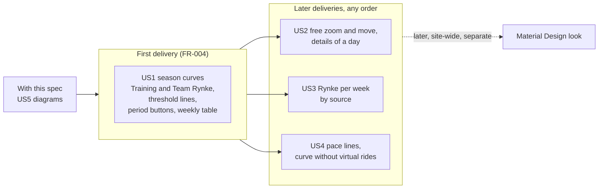

### D1. Where the curves come from

The page reads; it never evaluates and never calls Strava (FR-003). Whether the
rebuild runs with the evaluation or when the page is shown is left to planning
(FR-012).

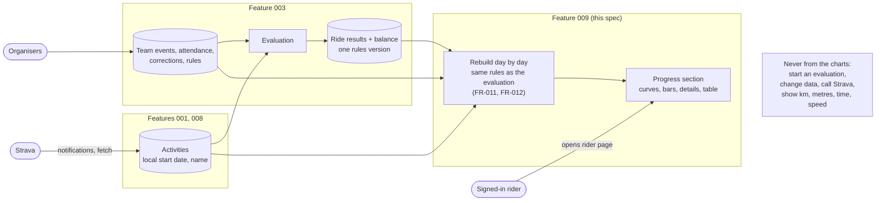

### D2. How a day's total is built (Sunday 20 September)

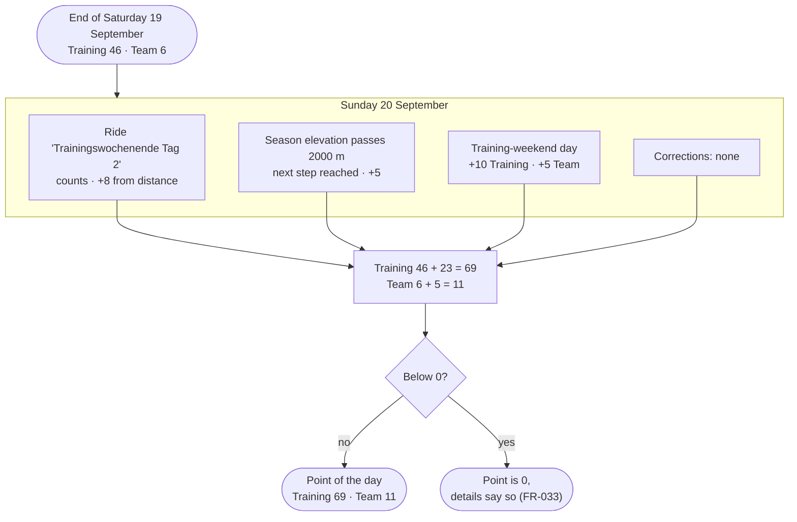

### D3. Section layout (desktop)

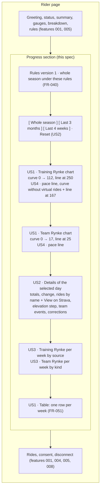

### D4. Section layout (phone, 360 pixels wide)

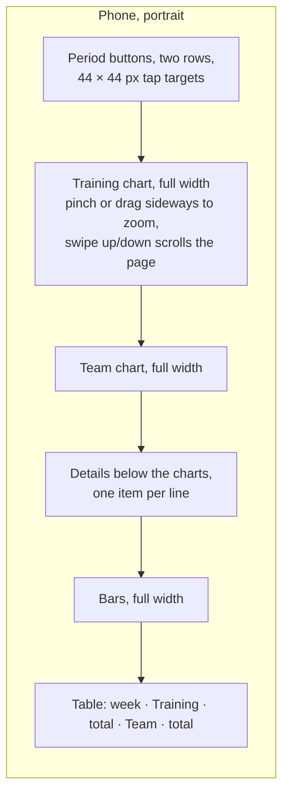

### D5. How the period changes

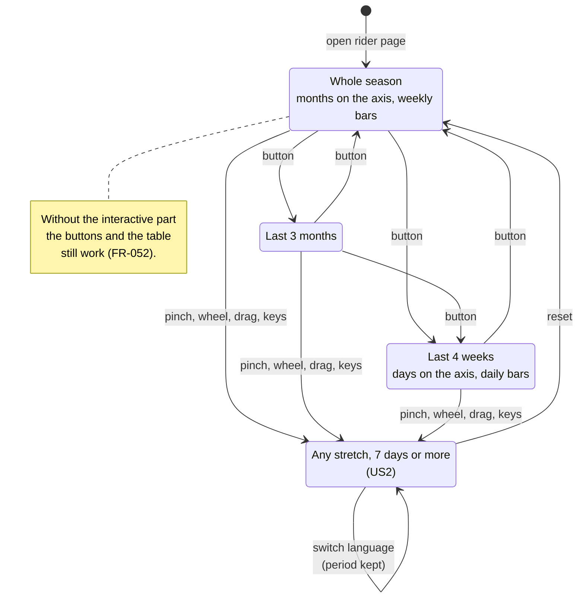

### D6. A rule change while the rider looks

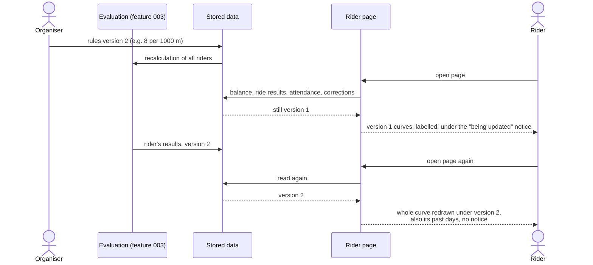

### D7. Example rider: season curves

Training Rynke at the end of each week, with the Training threshold:

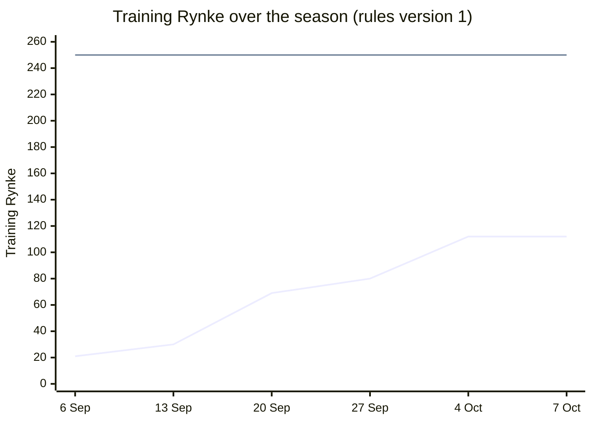

Team Rynke at the end of each week, with the Team threshold:

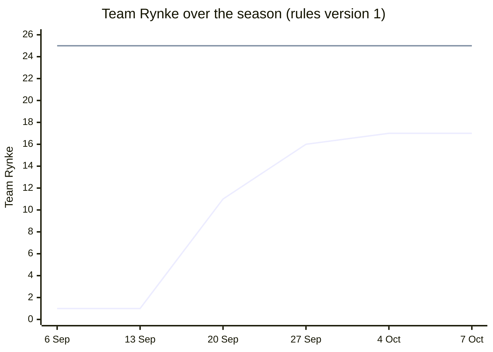

The drawn charts have one point per day; these show the end of each week. With the
deadline 31 May 2027, the pace line on 4 October is at 31 Training Rynke and 3 Team
Rynke (US4 scenario 1).

### D8. Example rider: Rynke per week

Training Rynke earned in each week (the drawn bars are divided by source):

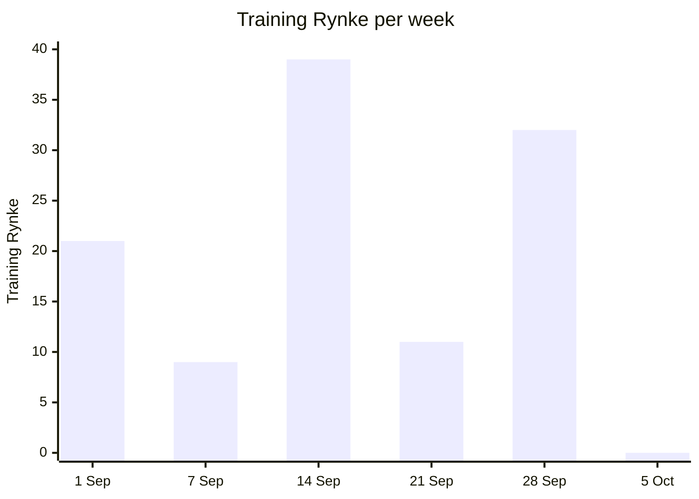

The bar of 14–20 September divided by source, one block per Training Rynke (US3
scenario 1):

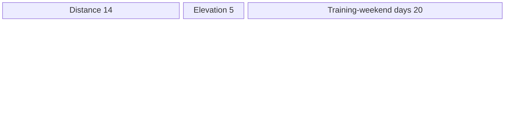

Team Rynke earned in each week:

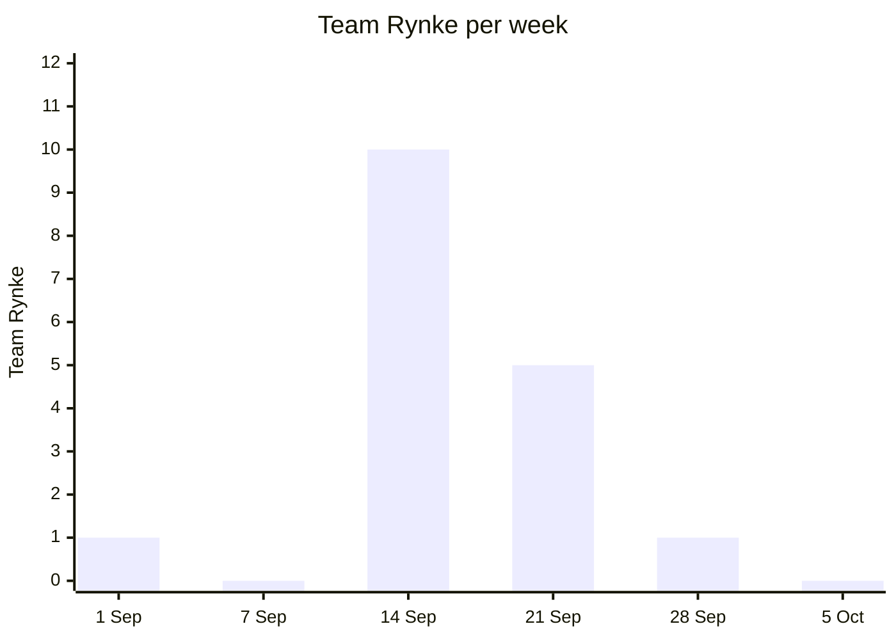
