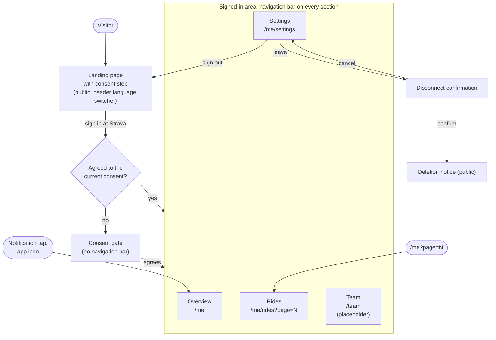
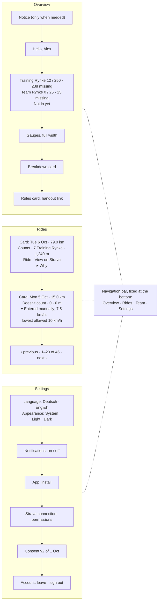
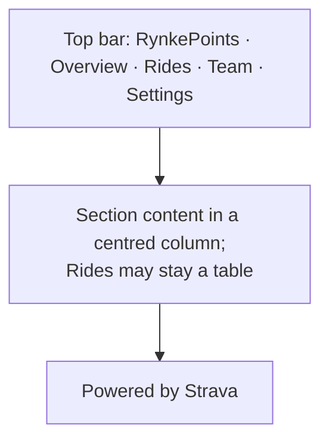

# Feature Specification: Mobile App Shell with Sections and a Material Look

**Feature Branch**: `011-mobile-app-shell`

**Created**: 2026-10-08

**Status**: Draft

**Input**: User description: "Mobile-first app shell with tabs and a Material Design
look for RynkePoints. Replaces GitHub issue #20 ("Make the whole site mobile
friendly") and covers everything in it. Today /me is one long scroll page. Instead,
the signed-in area becomes an app shell with sections the rider switches between:
Overview, Rides, Team (a 'coming soon' placeholder until the team leaderboard
feature fills it) and Settings. Each section is its own page, so the back button,
notification links, the language switch and the installed app keep working. A
bottom navigation bar on phones, a top bar on wider screens. Material Design
(Material 3) look for the whole site now, with design tokens, the Strava brand kept,
dark mode following the system setting. Pages stay server-rendered; no heavy
framework."

## Clarifications

### Session 2026-10-08

- Q: Must the site work without JavaScript or in old browsers? → A: No, that's out
  of scope; pages may break there.
- Q: Must pages be designed for a phone in landscape? → A: No, it isn't a real use
  case; only the lowest effort: nothing beyond what the portrait layout gives.
- Q: How does the installed app pick up new Rynke after it comes back from the
  background? → A: It reloads the current section when it returns to the
  foreground after more than a minute away, and when the rider taps the section
  that is already open; every section also has a visible refresh button.
- Q: Can riders choose light or dark mode themselves? → A: Yes. The app follows
  the system by default; Settings offers "System / Light / Dark", remembered on
  that device.
- Q: On a ride card, do the reasons start closed or open? → A: Closed for rides
  that count, open for rides that don't count; the rider can open or close
  either with a tap.

## User Scenarios & Testing *(mandatory)*

Riders open RynkePoints mostly on their phone, often as the installed app
(feature 010). Today the signed-in rider sees everything on one long page: greeting,
connection status, Rynke figures, gauges, breakdown, rules, notifications, the ride
table, consent and disconnect. This feature splits that page into **sections** the
rider switches between, makes every page of the site work on a phone, and gives the
whole site one consistent Material Design look.

The **signed-in area** is everything a rider who is signed in and has agreed to the
current consent (feature 004) sees. It has four **sections**:

| Section | Address | Contents |
|---|---|---|
| Overview | `/me` | Greeting, Training Rynke and Team Rynke against their thresholds, what is still missing, whether the rider is in, the gauges, the breakdown, the rules in effect, and notices that need the rider's attention (reconnect, import running, numbers being updated). |
| Rides | `/me/rides` | The rider's rides of the season with paging, whether each counts and why (feature 005 US1, US4, US5). |
| Team | `/team` | For now a placeholder saying the team leaderboard is coming. The team leaderboard feature ([backlog](../backlog/team-leaderboard.md)) fills it later. |
| Settings | `/me/settings` | Language, notifications (feature 010), installing the app, the Strava connection and its permissions, the accepted consent, leaving (disconnect) and signing out. |

The **navigation bar** is the control that switches between the sections: at the
bottom of the screen on a phone, at the top on wider screens. **Public pages** are
all pages outside the signed-in area: the landing page with the consent step, the
sign-in outcome and error notices, the consent gate, the disconnect and deletion
confirmations, and the offline page of the installed app.

### User Story 1 - Rider switches between sections instead of scrolling (Priority: P1)

A rider opens RynkePoints on their phone and lands on the Overview: their Training
and Team Rynke, how much is missing and the gauges, without a long list of rides or
settings below. A bar at the bottom with four labelled icons takes them to Rides,
Team or Settings with one tap. The current section is highlighted. The phone's back
button returns to the section they came from.

**Why this priority**: This is the change the rider notices. The single long page is
what makes the app tiring on a phone, and every other story builds on the sections.

**Independent Test**: Sign in as a synthetic rider on a 360-pixel-wide portrait
screen, check that `/me` shows only the Overview contents, tap each entry of the
navigation bar, check each section's contents and address, and use the back button.

**Acceptance Scenarios**:

1. **Given** a signed-in rider who agreed to the current consent, **When** they open
   `/me` on a phone, **Then** they see the Overview contents and the navigation bar
   at the bottom of the screen with Overview marked as current, and no ride list,
   notification controls, consent text or disconnect link.
2. **Given** the Overview, **When** the rider taps "Rides" in the navigation bar,
   **Then** `/me/rides` opens with the rider's rides and Rides is marked as
   current.
3. **Given** the rider went from Overview to Rides to Settings, **When** they press
   the back button twice, **Then** they are on Rides and then on the Overview.
4. **Given** the rider is on page 3 of Rides, **When** they reload or share the
   address with themselves, **Then** the same page of Rides opens.
5. **Given** a rider taps a "new Rynke" notification (feature 010), **When** the app
   opens, **Then** it shows the Overview.
6. **Given** a visitor who is not signed in, **When** they open `/me/rides`,
   `/me/settings` or `/team`, **Then** they are sent to the landing page, as for
   `/me` today.
7. **Given** a signed-in rider who hasn't agreed to the current consent, **When**
   they open any section, **Then** they see the consent gate (feature 004) and no
   navigation bar, and after agreeing they reach the section they asked for.
8. **Given** the screen is wider than a phone, **When** the rider opens any
   section, **Then** the navigation bar sits at the top of the page and works the
   same way.

---

### User Story 2 - Every page works on a phone (Priority: P1)

Every page of the site reads well on a phone in portrait: no zooming, no sideways
scrolling, and buttons and links large enough to hit with a thumb. On Rides each ride
is a card with the facts the rider needs at a glance; why a ride counts or doesn't
opens with a tap. This is everything issue
[#20](https://github.com/SaSteffen/RynkePoints/issues/20) asks for.

**Why this priority**: Riders use the app mostly on their phone. A section that needs
zooming or sideways scrolling is broken for them, whatever it shows.

**Independent Test**: Open every section and every public page on a 360-pixel-wide
portrait screen, in German and English, with a synthetic rider that has many rides
and long ride names, and check reading, scrolling and tap target sizes.

**Acceptance Scenarios**:

1. **Given** a screen 360 pixels wide in portrait, **When** any page of the site is
   opened, **Then** all its text reads without zooming and the page doesn't scroll
   sideways.
2. **Given** Rides on a phone, **When** the rider looks at a ride, **Then** they see
   its date, distance, whether it counts, its Training Rynke and its metres without
   opening anything, and sport type, elevation gain, the virtual mark, the
   "View on Strava" link and the reasons are on the same card; the reasons are
   closed behind a tap for a ride that counts and open for a ride that doesn't.
3. **Given** a ride with a very long name, **When** its card is shown, **Then** the
   name wraps and no part of the page scrolls sideways.
4. **Given** a phone, **When** the rider taps a navigation bar entry, a paging
   control, a button or a link, **Then** each target is at least about 44 × 44
   pixels and doesn't overlap a neighbouring target.
5. **Given** a phone with a home indicator or rounded corners, **When** the
   navigation bar is shown, **Then** no part of it sits under the home indicator or
   the screen edge, and the last content of the page isn't hidden behind the bar.
6. **Given** a desktop browser, **When** any page is opened, **Then** everything a
   rider could do before is still there and reachable.

---

### User Story 3 - The whole site has one Material look, light and dark (Priority: P2)

Every page, public or signed in, follows Material Design: the same colours, type,
spacing, cards, buttons and navigation. The Strava orange stays the brand colour and
the "Powered by Strava" attribution stays visible. When the phone is set to dark
mode, RynkePoints is dark too, unless the rider picked a fixed scheme in Settings.

**Why this priority**: The sections work without it, but a consistent, familiar look
is what makes the installed app feel like an app rather than a web page. It comes
after the sections because it styles them.

**Independent Test**: Open every page in light and dark system mode on a phone and
on a desktop, and check that colours, type, buttons and cards match across pages,
that text and controls keep enough contrast, and that the Strava attribution and
links follow Strava's brand guidelines.

**Acceptance Scenarios**:

1. **Given** the system is in light mode, **When** any page is opened, **Then** it
   uses the light colour scheme, and in dark mode the dark one, without the rider
   doing anything.
6. **Given** a rider picked "Dark" in Settings on their phone, **When** they open
   any page on that phone, public pages included, **Then** it is dark whatever the
   system setting, without first flashing light; their other devices still follow
   their own setting.
2. **Given** any two pages, **When** they are compared, **Then** headings, body text,
   buttons, cards and links look the same on both.
3. **Given** either colour scheme, **When** the gauges are shown, **Then** each part
   keeps its meaning and colour key from feature 005, and a reached target is still
   recognisable as reached.
4. **Given** either colour scheme, **When** the "Powered by Strava" attribution is
   shown, **Then** it is Strava's variant for that background (light or dark).
5. **Given** figures in the Overview and on Rides, **When** several are shown one
   above the other, **Then** their digits line up.

---

### User Story 4 - Rider finds every setting in one place (Priority: P2)

A rider who wants to turn notifications on, switch the language or light and dark
mode, install the app,
change the Strava permissions, read what they agreed to, leave or sign out goes to
Settings and finds all of it there, grouped.

**Why this priority**: These controls are rarely used, which is why they shouldn't
crowd the Overview, but each must stay easy to find.

**Independent Test**: Open Settings as a synthetic rider and do each action: change
the language and the appearance, turn notifications on and off, open the Strava permission change,
start leaving, and sign out.

**Acceptance Scenarios**:

1. **Given** Settings, **When** the rider looks at it, **Then** it shows the groups
   Language, Appearance (System / Light / Dark), Notifications, App (install),
   Strava connection (status, which permissions are given, change permissions,
   reconnect if needed), Consent (the accepted version and date, what is read and
   who sees what), and Account (leave, sign out).
2. **Given** Settings, **When** the rider picks the other language, **Then** Settings
   shows again in that language.
3. **Given** a signed-in rider, **When** they look at any section other than
   Settings, **Then** there is no language switcher in the header.
4. **Given** Settings, **When** the rider chooses to leave, **Then** they see the
   disconnect confirmation, and cancelling takes them back to Settings.
5. **Given** the installed app or a browser that can't install it, **When** Settings
   is shown, **Then** the install group is left out, as feature 010 leaves out the
   hint.

---

### User Story 5 - Team section is visible but not yet filled (Priority: P3)

The rider sees a Team entry in the navigation bar. It opens a page that says the team
leaderboard is coming, so the navigation already has its final shape and riders know
what to expect.

**Why this priority**: It shows nothing new; it only keeps the navigation stable for
when the leaderboard arrives.

**Independent Test**: Open `/team` as a synthetic rider and as a synthetic organiser
and check that it shows the placeholder text and no data of any rider.

**Acceptance Scenarios**:

1. **Given** a signed-in rider, **When** they tap "Team", **Then** they see a short
   text that the team leaderboard is coming, with Team marked as current.
2. **Given** an organiser, **When** they open Team, **Then** they see the same
   placeholder.
3. **Given** the Team placeholder, **When** it is shown, **Then** it contains no
   name, figure or other data of any rider.

---

### Edge Cases

- **Old addresses**: `/me?page=N` (from feature 005) leads to `/me/rides?page=N`, so
  a saved or shared link still shows the same rides. An address with an invalid page
  behaves as feature 005 defines for Rides.
- **Rider has no rides yet or the import is still running**: Rides shows feature
  005's empty or importing state; the Overview shows the import notice.
- **Rider needs to reconnect**: the Overview shows the reconnect notice with its link
  at the top, and Settings shows the same state in the Strava connection group.
- **Numbers are being updated** (rule change, feature 005 US6): the notice shows on
  the Overview and on Rides.
- **Offline in the installed app**: the offline page (feature 010) takes the new look
  without the navigation bar, because no section can be shown offline.
- **Language switch on a section**: switching the language in Settings keeps the
  rider on Settings. On public pages the switcher in the header keeps the current
  page, as today.
- **Very small or very large text settings**: with the phone's text size raised,
  the navigation bar labels may wrap or shorten but every entry stays tappable and
  the page still doesn't scroll sideways.
- **Landscape phone**: not designed for. Pages get whatever the portrait or wide
  layout gives them; nothing extra is built or tested for it.
- **Rider returns to the installed app after a ride**: the section reloads by
  itself if the app was in the background for more than a minute; otherwise the
  refresh control or tapping the current section shows the latest numbers.
- **Session ends while the rider switches sections**: the next section they open
  sends them to the landing page, as `/me` does today.
- **Organiser**: sees the same four sections as every rider; organiser pages
  (backlog) are not part of this feature.

## Requirements *(mandatory)*

### Functional Requirements

**Sections and navigation**

- **FR-001**: The signed-in area MUST consist of four sections, each with its own
  address: Overview (`/me`), Rides (`/me/rides`), Team (`/team`) and Settings
  (`/me/settings`), with the contents listed in the sections table above.
- **FR-002**: Every section MUST show the navigation bar with one labelled entry per
  section, in the order Team, You (the Overview), Rides, Orga (organisers only,
  feature 016), Settings. Each entry MUST have an icon and a text label, and the
  current section MUST be marked both visibly and for screen readers. Team is the
  main page: a signed-in rider who opens `/`, signs in, agrees, or starts the
  installed app lands on `/team`, and Team also shows the reconnect notice. The
  addresses stay as in FR-001 (issue #73).
- **FR-003**: Switching sections MUST be ordinary page navigation: each section can
  be reloaded, bookmarked and reached with the back and forward buttons, and the
  rides page shown is part of the Rides address.
- **FR-004**: On screens narrower than a tablet the navigation bar MUST sit fixed at
  the bottom of the screen, clear of the home indicator and screen edges, and MUST
  NOT cover page content. On wider screens it MUST sit at the top of the page.
- **FR-005**: The site MAY rely on JavaScript and on current browsers (the last two
  major versions of Safari on iOS, Chrome on Android, and desktop Chrome, Firefox,
  Safari and Edge). Without JavaScript or in older browsers pages may break.
- **FR-006**: The address `/me?page=N` MUST lead to `/me/rides?page=N`.
- **FR-007**: The sections MUST follow the access rules of `/me` today: a visitor is
  sent to the landing page, and a rider without the current consent sees the consent
  gate (feature 004) without the navigation bar and reaches the section they asked
  for after agreeing.
- **FR-008**: Tapping a notification (feature 010) and opening the installed app
  MUST still lead to the Overview.

- **FR-009**: Every section MUST have a visible refresh control that reloads it.
  The current section MUST also reload when the rider taps its entry in the
  navigation bar, and when the page comes back to the foreground after more than
  one minute in the background. A reload keeps the rider on the same section and
  rides page.

**Section contents**

- **FR-010**: The Overview MUST show, in this order: notices that need the rider's
  attention (reconnect, import running or done, numbers being updated, new season
  without rides), the greeting, the summary with Training Rynke and Team Rynke,
  the gauges, the breakdown, and the rules in effect with the handout link
  (feature 005 US1–US3, US6). It MUST NOT show the ride list, settings, consent text
  or account actions.
- **FR-011**: On a 360-pixel-wide portrait screen, the Overview MUST show the two
  totals, what is missing and whether the rider is in without scrolling.
- **FR-012**: Rides MUST show everything the ride table of feature 005 shows (US1,
  US4, US5), with the same paging and the same 20 rides per page.
- **FR-013**: Team MUST show only a short text that the team leaderboard is coming. It
  MUST NOT show any data of any rider until the team leaderboard feature replaces it.
- **FR-014**: Settings MUST group, in this order: Language, Appearance (FR-032a),
  Notifications (feature 010's controls and states), App (feature 010's install
  hint, left out where 010 leaves it out), Strava connection (status, given permissions, change permissions,
  reconnect if needed), Consent (accepted version and date, what is read, who sees
  what), Account (leave with its confirmation, sign out).
- **FR-015**: The disconnect confirmation's "cancel" MUST lead back to Settings.
- **FR-016**: For signed-in riders the language switcher MUST appear only in
  Settings; switching there MUST keep the rider on Settings. Public pages MUST keep
  the language switcher in the header, keeping the current page as today.
- **FR-017**: The install hint MAY also appear on the Overview where feature 010
  shows it, but MUST NOT push the totals below the first screen (FR-011).

**Phones (replaces issue #20)**

- **FR-020**: Every page of the site, public or signed in, MUST read on a phone in
  portrait with a screen 360 pixels wide without zooming and without scrolling the
  page sideways. Strava's own approval screen is out of scope.
- **FR-021**: On a narrow screen each ride MUST be shown as a card that keeps date,
  distance, whether the ride counts, its Training Rynke and its metres in view;
  sport type, elevation gain, the virtual mark, the "View on Strava" link and the
  reasons MUST stay on the card. The reasons MUST start closed (one tap opens
  them) for a ride that counts and open for a ride that doesn't count; the rider
  can close or open either. This refines feature 005 FR-071. On wide screens
  Rides MAY stay a table.
- **FR-022**: Every control MUST be easy to tap: navigation bar entries, buttons,
  links that stand alone, paging controls, the language switcher and the control
  that opens a ride's reasons MUST offer a target of at least about 44 × 44 pixels.
- **FR-023**: Long words, ride names and numbers MUST wrap or shorten rather than
  widen the page.
- **FR-024**: Everything a rider can do or see on desktop today MUST still be
  possible on desktop, in its new section.

**Look (Material Design)**

- **FR-030**: Every page MUST follow Material Design 3: its colour roles, type
  scale, spacing, shapes and components (top or navigation bar, cards, buttons,
  lists) for the elements each page has.
- **FR-031**: Colours, type sizes, spacing and corner shapes MUST be defined once
  for the whole site, so changing one of them changes it on every page.
- **FR-032**: The colour scheme MUST be derived from the Strava orange used today
  as the brand colour. The site MUST offer a light and a dark scheme and follow the
  system setting by default.
- **FR-032a**: Settings MUST offer the choice "System", "Light" or "Dark"
  (default "System"). The choice MUST be remembered on that device only, apply to
  every page there (public pages included) from the first paint without flashing
  the other scheme, and survive signing out. It is not rider data and is not
  stored on the server with the rider.
- **FR-033**: Text and controls MUST meet a contrast of at least 4.5 : 1 for body
  text and 3 : 1 for large text, icons and control outlines, in both schemes.
- **FR-034**: The "Powered by Strava" attribution MUST stay on every page in
  Strava's variant for the scheme's background, and "View on Strava" links MUST keep
  following Strava's brand guidelines in both schemes.
- **FR-035**: The gauges MUST keep their meaning, parts and colour key from feature
  005 in both schemes; colours MAY change to fit the scheme as long as the parts
  stay distinguishable from each other and from the empty track.
- **FR-036**: Figures that are compared (totals, thresholds, distances, Rynke,
  metres) MUST use digits of equal width.
- **FR-037**: The site MUST NOT load fonts, icons or styles from third-party
  servers; the look MUST NOT make any page noticeably slower to open on a phone.
- **FR-038**: Movement (e.g. section changes, opening a ride's reasons) MUST be
  left out when the system asks for reduced motion.
- **FR-039**: The installed app's colours (theme and background colour of feature
  010) MUST match the scheme in use.

**Language**

- **FR-040**: All new text (section names, Settings group headings, the Team
  placeholder, labels for screen readers) MUST come from the message catalogs, in
  German and English.

### Key Entities

- **Section**: one part of the signed-in area with its own address, name, icon and
  contents (Overview, Rides, Team, Settings). Holds no data of its own; it shows
  what features 004, 005 and 010 already provide.
- **Design tokens**: the site-wide set of colours (for light and dark), type sizes,
  spacing and corner shapes every page draws from (FR-031).

## Success Criteria *(mandatory)*

### Measurable Outcomes

- **SC-001**: On a 360-pixel-wide portrait screen, 100 % of pages (all sections and
  all public pages, German and English, light and dark) show no sideways scrolling
  and need no zooming to read.
- **SC-002**: From any section, a rider reaches any other section in one tap.
- **SC-003**: On a 360-pixel-wide portrait screen, the Overview shows both totals,
  what is missing and whether the rider is in without scrolling.
- **SC-004**: 100 % of controls on a phone offer a target of at least about
  44 × 44 pixels.
- **SC-005**: Every action available on `/me` before this feature is reachable in
  at most two taps from the Overview.
- **SC-006**: Text contrast meets FR-033 on every page in both schemes.
- **SC-007**: Opening a section on a phone over a mobile connection takes no longer
  than opening `/me` did before this feature.
- **SC-008**: Every acceptance criterion of issue
  [#20](https://github.com/SaSteffen/RynkePoints/issues/20) holds, so it can be closed
  with this feature.

## Assumptions

- Builds on features 001 (sign-in, languages), 004 (consent gate, roles), 005
  (rider view) and 010 (installed app, notifications). What those features show,
  read and store doesn't change; this feature only moves it into sections and
  restyles it. No data, consent text or Strava request changes, so no new consent
  version is needed (constitution Principle I).
- This feature replaces issue #20 and the "Material Design later" plans in feature
  005's assumptions. Its pull request closes issue #20.
- The sections, phone layouts and the Material look ship together in one release; the
  user stories give the build order, not separate releases.
- Phones in landscape and browsers without JavaScript are out of scope (FR-005).
- "Tablet" in FR-004 follows Material's window size classes: below about 600 pixels
  wide the bar sits at the bottom. The exact breakpoint is a planning decision.
- Material Design here means its published guidelines, not a component library;
  planning decides how to build it within the constitution's minimal-dependency rule
  (Principle IV) and FR-037. The system font may stand in for Material's typeface.
- The exact colours, icons and spacing are settled during planning. A clickable phone
  mock-up (e.g. from Claude Design) may be made first to agree on the look; it is a
  reference for planning, and this spec stays authoritative.
- Dynamic colour from the rider's wallpaper (Material You) is not used; the scheme is
  fixed to the brand colour.
- The Team placeholder is replaced by the team leaderboard feature; organiser pages
  (backlog) may later add a section or live inside Team, which that feature decides.
- Feature 009's charts, once built, belong to the Overview.

## Diagrams

The text above is authoritative.

### D1. Sections and pages

### D2. Phone layout (360 pixels wide, portrait)

### D3. Wide screen layout

